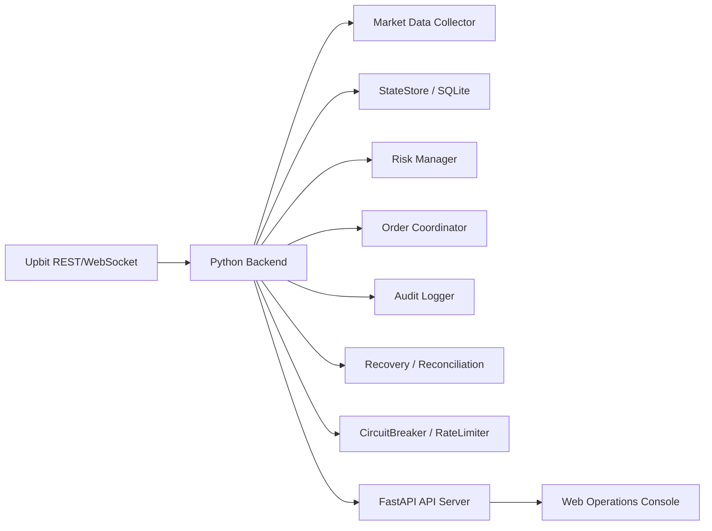

# UFS-R1 자동매매 시스템 개발 기획

작성일: 2026-05-31  
참조 문서:

- `docs/feature_specification.md`
- `docs/development_spec.md`
- `docs/upbit_api_and_trading_system.md`
- `docs/ufs-r1_strategy.md`
- `docs/risk_controls_and_final_decision.md`
- `docs/backtest_and_paper_trading.md`
- `DESIGN.md`

## Summary

UFS-R1은 업비트 현물 자동매매 시스템이다. 문서 기준으로 가장 중요한 것은 수익 신호보다 **주문 안전성, 리스크 차단, 장애 복구, 검증 가능성**이다.

개발지시를 작성할 때는 `docs/feature_specification.md`를 기능 요구사항의 기준 문서로 사용하고, 이 문서는 그 기능을 어떤 순서와 구조로 구현할지 정리한 개발 기획 문서로 사용한다.

따라서 1차 개발은 다음 두 축으로 진행한다.

1. **자동매매 코어 백엔드**
   - 업비트 실시간 데이터 수집, 가상 KRW 잔고, 가상 주문/체결/포지션, 리스크 매니저, PAPER 실행.
2. **운영자 웹 콘솔**
   - 봇 상태, 차단 사유, 가상 주문/포지션 상태, 데이터 품질, 킬스위치, 감사 로그, 페이퍼 설정을 사람이 확인하고 조작하는 화면.

첫 릴리스 목표는 **실거래 LIVE가 아니라 `PAPER + 운영 콘솔`**이다. 이때 `PAPER`는 단순 신호 표시가 아니라 실제 업비트 실시간 시세를 사용해 사용자가 정한 가상 KRW 현금으로 매수, 매도, 미체결, 부분 체결, 손절, 익절, PnL을 기록하는 모의 매매다.

## Architecture

권장 구조:



기술 스택:

| 영역 | 선택 |
|---|---|
| 백엔드 | Python 3.11+ |
| API 서버 | FastAPI |
| 저장소 | SQLite 우선, 추후 PostgreSQL 가능 |
| 프론트엔드 | Next.js 또는 React |
| 차트 | TradingView Lightweight Charts |
| 스타일 | `DESIGN.md` 기반 다크 운영 대시보드 |
| 테스트 | pytest, Playwright |

## Core Backend Plan

### 0. M0 계약 고정

구현 전 가장 먼저 다음 계약을 문서와 코드 타입으로 고정한다.

- 도메인 모델: `OrderIntent`, `OrderState`, `Fill`, `PositionState`, `ExecutionEvent`, `RiskBlock`, `DataQualityState`, `ReconciliationState`, `ModeState`, `Alert`.
- 상태 전이 규칙: 허용 상태 전이, 금지 상태 전이, 실패 시 기록 방식.
- DB 제약:
  - `exchange_identifier`는 전역 `UNIQUE`.
  - 활성 상태의 동일 `client_order_key` 중복 생성 금지.
  - `ExecutionEvent`는 append-only.
  - `OrderState`에는 상태 전이 충돌 방지를 위한 version 컬럼을 둔다.
- API 공통 응답 형식과 오류 응답 형식.
- 상태 변경 API의 공통 입력: `request_id`, `idempotency_key`, `operator_id`, `reason`.

M0가 끝나기 전에는 화면 구현과 전략 검출기 구현을 시작하지 않는다.

### 1. 프로젝트 뼈대

생성할 주요 영역:

- `src/haley/config.py`
- `src/haley/domain.py`
- `src/haley/state_store.py`
- `src/haley/audit_log.py`
- `src/haley/orders.py`
- `src/haley/risk.py`
- `src/haley/exchange.py`
- `src/haley/recovery.py`
- `src/haley/reconciliation.py`
- `src/haley/circuit_breaker.py`
- `src/haley/rate_limit.py`
- `src/haley/alerts.py`
- `src/haley/api/`

핵심 원칙:

- 주문/잔고/체결/수수료/PnL은 `Decimal` 사용.
- 모든 이벤트는 `ExecutionEvent`로 기록.
- API Secret, JWT, nonce, query hash는 로그 저장 금지.
- 주문 의도 저장, `OrderState` 상태 전이, `ExecutionEvent` 기록은 하나의 DB 트랜잭션으로 처리.

### 2. 운영 모드

지원 모드:

- `BACKTEST`
- `PAPER`
- `DRY_RUN`
- `LIVE`
- `RECOVERY_ONLY`
- `KILL_SWITCHED`

1차 구현에서 실제 동작시킬 모드:

- `PAPER`
- `DRY_RUN`
- `RECOVERY_ONLY`
- `KILL_SWITCHED`

`PAPER`는 기본 실행 모드다. `DRY_RUN`은 실제 주문 API 호출 직전의 요청 형식, 최소 주문금액, 호가 단위, 권한 오류를 검증하는 후속 안전 점검 모드다. `LIVE`는 코드 구조상 enum만 두고, 실제 주문 API 호출은 후속 단계에서 별도 승인 후 열어야 한다.

초기 운영 정책:

- 실행 환경은 로컬 PC다.
- 기준 통화는 KRW 현금이다.
- 거래 대상은 KRW 마켓의 거래대금 상위 알트 10개다. 초기 기본값에서는 BTC/ETH 같은 메이저 마켓은 제외한다.
- 외부 리스크 데이터는 사용하지 않고 `UPBIT_ONLY`로 시작한다.
- 알림 기능의 내부 이벤트와 화면은 구현하되, Telegram/Discord/Slack 같은 채널 연동은 보류한다.
- 킬스위치, 재개 승인, 긴급 청산 같은 위험 결정은 모두 사용자가 화면에서 직접 수행한다.

실시간 실행 우선순위:

```text
KillSwitch > Recovery > CircuitBreaker > Reconciliation > Risk > DataQuality > Signal > Execution
```

앞 단계가 차단 상태이면 뒤 단계는 주문 의도를 만들 수 없다.

### 3. 주문 안전성

필수 구현:

- `client_order_key` 생성
- 업비트 `identifier`와 내부 키 분리
- 주문 제출 전 의도 저장
- timeout 시 `UNKNOWN` 저장
- `UNKNOWN`, `SUBMITTING`, `PARTIALLY_FILLED` 주문이 있으면 같은 마켓 신규 진입 금지
- 상태 전이 없는 포지션 변경 금지
- 부분 체결이 발생하면 체결 수량만 포지션에 반영하고 즉시 손절 감시 상태를 생성
- `max_unprotected_position_sec`를 초과한 보호 없는 포지션이 있으면 신규 진입 금지, 알림 생성, 감사 로그 기록

주문 상태:

```text
PLANNED
SUBMITTING
UNKNOWN
ACCEPTED
PARTIALLY_FILLED
FILLED
CANCEL_REQUESTED
CANCELLED
CANCEL_FAILED
REJECTED
RECONCILED
```

### 4. 리스크 매니저

필수 차단 조건:

- 킬스위치 ON
- 복구 미완료
- 데이터 stale
- REST/WebSocket 불일치
- 일 손실 한도 초과
- 연속 손절 초과
- 종목별/전체 노출 초과
- 보호 없는 포지션 존재
- 잔고/locked 동기화 실패
- 주문 권한 오류
- 유의종목/주의 경보

### 5. 복구, 대조, 레이트 리밋

P0 안전 기반에는 다음 컴포넌트를 포함한다.

- `RecoveryManager`
  - 시작/재시작 시 `RECOVERY_ONLY`로 진입.
  - 잔고 조회, 미체결 주문 조회, 주문 상세 대조, 포지션 재계산, 불일치 기록, 재개 가능성 판정을 단계별로 수행.
- `ReconciliationWorker`
  - 로컬 주문/포지션과 거래소 상태를 주기적으로 대조.
  - 불일치 시 거래소 상태를 우선하고 `reconciliation_mismatch` 이벤트 기록.
- `CircuitBreaker`
  - API 장애, 데이터 지연, 잔고 불일치, 손실 한도 초과, 취소 실패, 보호 없는 포지션 발생 시 신규 진입 중단.
- `RateLimiter`
  - REST 요청은 `Remaining-Req` 기반 토큰 버킷으로 제한.
  - 429는 지수 백오프로 처리.
  - 418은 응답의 차단 시간 동안 신규 주문과 청산 외 주문을 중단.

### 6. 최소 데이터 품질 기반

초기 단계부터 다음 상태를 계산한다.

- WebSocket 마지막 수신 시각.
- REST 보정 마지막 성공 시각.
- stale 여부.
- REST/WebSocket 가격 또는 캔들 불일치 여부.
- `market_event.warning`, `market_event.caution` 여부.
- 호가 공백 또는 예상 슬리피지 초과 여부.

이 정보는 주문 차단과 운영 콘솔 표시의 공통 근거로 사용한다.

## User Interface Plan

사용자 화면은 “트레이딩 실행 화면”이 아니라 **자동매매 운영 감시 화면**이다.

`DESIGN.md`는 시각 스타일만 정의하므로, 실제 화면 구성은 기능 요구에서 새로 정의한다.

### 1. 운영 요약 화면

목적: 지금 봇이 안전한지 한눈에 확인.

표시 항목:

- 현재 운영 모드
- 킬스위치 상태
- WebSocket 연결 상태
- REST 보정 상태
- 마지막 데이터 수신 시각
- 신규 주문 가능 여부
- 현재 차단 사유
- 미확정 주문 수
- 보호 없는 포지션 수
- 당일 실현 손익
- 일 손실 한도 사용률
- 즉시 확인이 필요한 알림 수
- 현재 복구 단계
- 재개 가능 여부

필수 액션:

- 킬스위치 ON
- 복구 실행
- PAPER 상태 확인
- 페이퍼 가상 잔고 리셋 요청

운영 콘솔은 상태를 보여주는 것뿐 아니라, 각 차단 사유별로 운영자가 취할 수 있는 다음 행동, 해소 조건, 자동 해소 가능 여부, 수동 승인 필요 여부를 함께 표시해야 한다.

### 2. 주문/포지션 화면

목적: 주문 상태 머신과 포지션 보호 상태 확인.

표시 항목:

- 주문 목록
  - 마켓
  - `client_order_key`
  - `identifier`
  - 상태
  - 요청 금액/수량
  - 체결 수량
  - 남은 수량
  - 마지막 오류
  - 마지막 업데이트 시각
- 포지션 목록
  - 마켓
  - 보유 수량
  - 평균 진입가
  - 손절가
  - 보호 상태
  - 실현/미실현 PnL
  - 마지막 업데이트 시각

필수 액션:

- 주문 상세 보기
- 관련 감사 로그 보기
- PAPER 취소/미체결 시뮬레이션
- DRY_RUN 주문 요청 원문 보기
- 수동 복구 플래그 확인
- `UNKNOWN` 주문 거래소 조회 시작
- 잔고/locked 대조 결과 확인

주문/포지션 API는 UI가 임의 판단하지 않도록 상태별 가능한 액션 목록을 함께 반환한다.

### 3. 차단 사유/리스크 화면

목적: 왜 주문하지 않았는지 설명.

표시 항목:

- hard block 목록
- data quality block 목록
- risk block 목록
- exchange/API block 목록
- market event block 목록

예시 차단 코드:

```text
KILL_SWITCHED
RECOVERY_ONLY
UNKNOWN_ORDER_EXISTS
DATA_STALE
DATA_MISMATCH
DAILY_LOSS_LIMIT
EXPOSURE_LIMIT
UNPROTECTED_POSITION
MARKET_WARNING
API_RATE_LIMITED
```

각 차단 사유는 다음을 가져야 한다.

- 코드
- 사람이 읽는 설명
- 발생 시각
- 관련 마켓
- 해소 조건
- 심각도
- 영향 범위
- 운영자 다음 행동
- 자동 해소 가능 여부
- 수동 승인 필요 여부
- runbook ID 또는 문서 링크

### 4. 데이터 품질 화면

목적: 신규 주문이 막힌 데이터 원인을 마켓별로 확인.

표시 항목:

- 마켓
- ticker/trade/orderbook/candle 마지막 수신 시각
- REST 보정 상태
- stale 여부
- REST/WebSocket 불일치 여부
- synthetic candle 사용 여부
- market warning/caution 여부
- 예상 슬리피지
- 현재 차단 코드

### 5. 복구 진행 화면

목적: `RECOVERY_ONLY`에서 무엇이 진행 중이고 어디서 실패했는지 확인.

복구 단계:

1. 잔고 조회
2. 미체결 주문 조회
3. 주문 상세 대조
4. 포지션 재계산
5. 불일치 기록
6. 재개 가능성 판정

각 단계는 `pending`, `running`, `succeeded`, `failed`, `skipped` 중 하나의 상태를 가진다.

킬스위치 해제 또는 거래 재개는 P0에서 자동 처리하지 않는다. 해제 화면은 차단 사유가 모두 해소되었는지, 쿨다운이 지났는지, 재개 후 24시간 리스크 축소가 적용되는지 표시하고 운영자 확인을 요구한다.

### 6. 알림/장애 인박스 화면

목적: 즉시 확인이 필요한 운영 이벤트를 놓치지 않도록 추적.

표시 항목:

- 알림 ID
- 심각도
- 이벤트 코드
- 관련 마켓
- 발생 시각
- 확인자
- 확인 시각
- 조치 상태
- 연결된 감사 로그 이벤트

필수 이벤트:

- `UNPROTECTED_POSITION`
- `UNKNOWN_ORDER_EXISTS`
- `CANCEL_FAILED`
- `DATA_MISMATCH`
- `API_RATE_LIMITED`
- `RECOVERY_FAILED`
- `KILL_SWITCHED`

알림 확인과 조치 완료는 감사 로그에 남긴다.

### 7. 감사 로그 화면

목적: 모든 판단과 상태 전이를 추적.

표시 항목:

- 시간
- 이벤트 타입
- 마켓
- 신호 ID
- 주문 키
- 이전 상태
- 이후 상태
- 차단 사유
- 오류 코드
- 원문 요청/응답 중 민감값 제거본

필터:

- 이벤트 타입
- 마켓
- 주문 상태
- 오류 여부
- 기간

### 8. 검증/승격 상태 화면

목적: 백테스트, 페이퍼, DRY_RUN, 소액 실거래로 넘어가는 조건을 확인.

표시 항목:

- 현재 승격 단계
- 통과 조건
- 미충족 조건
- 마지막 검증 시각
- 검증 데이터 기간
- 주문/리스크 오류 수
- 페이퍼 신호 수
- LIVE 해금 가능 여부

### 9. 설정 화면

P0에서는 위험 설정은 읽기 전용으로 두되, 페이퍼 실행에 필요한 안전한 설정은 화면에서 변경할 수 있게 한다.

표시 항목:

- 운영 모드
- 페이퍼 시작 가상 현금
- 페이퍼 리셋 여부
- 페이퍼 체결 모델
- 거래대금 상위 알트 개수
- 메이저 마켓 포함 여부
- 리스크 파라미터
- 주문 제한값
- 외부 리스크 모드
- API 권한 상태
- 알림 설정 상태
- 설정값 출처
- 적용 시각
- 마지막 변경자
- 유효성 상태

P0에서 화면 변경을 허용하는 값은 `PAPER_INITIAL_CASH_KRW`, `PAPER_RESET_ON_START`, `PAPER_ORDER_FILL_MODEL`, `TOP_ALT_COUNT`, `INCLUDE_MAJOR_MARKETS`, `KILL_SWITCH_ON_START`처럼 실제 주문을 발생시키지 않는 값으로 제한한다. `LIVE_TRADING_ENABLED`, API 키, 주문 권한, 핵심 리스크 한도 변경은 P0 범위에서 제외한다. 추후 구현 시 확인 모달과 변경 감사 로그가 필수다.

## API Interfaces

프론트엔드가 사용할 최소 API:

```text
GET /api/status
GET /api/orders
GET /api/orders/{order_id}
GET /api/positions
GET /api/risk/blocks
GET /api/data-quality
GET /api/audit-events
GET /api/alerts
GET /api/settings
PATCH /api/settings/paper
POST /api/alerts/{alert_id}/ack
POST /api/kill-switch/enable
POST /api/kill-switch/disable-request
POST /api/kill-switch/disable-confirm
POST /api/recovery/run
GET /api/recovery/runs/{recovery_run_id}
POST /api/dry-run/order
POST /api/paper/reset
```

응답 원칙:

- 금액/가격/수량은 문자열로 반환한다.
- 상태값은 enum 문자열로 반환한다.
- 민감 정보는 절대 반환하지 않는다.
- 모든 API 응답에는 `server_time`을 포함한다.
- 목록 API는 커서 기반 페이지네이션을 지원한다.
- 오류 응답은 공통 형식을 사용한다.

공통 오류 응답:

```json
{
  "server_time": "2026-05-31T00:00:00Z",
  "request_id": "req_...",
  "error": {
    "code": "UNKNOWN_ORDER_EXISTS",
    "message": "같은 마켓에 상태 미확정 주문이 있어 신규 주문을 만들 수 없습니다.",
    "retryable": false,
    "details": {}
  }
}
```

상태 변경 API 공통 입력:

```json
{
  "request_id": "req_...",
  "idempotency_key": "idem_...",
  "operator_id": "operator_...",
  "reason": "운영상 필요한 사유"
}
```

`/api/status`는 최소한 다음 필드를 반환한다.

```json
{
  "server_time": "2026-05-31T00:00:00Z",
  "mode": "PAPER",
  "can_place_new_order": false,
  "global_blocks": ["UNKNOWN_ORDER_EXISTS"],
  "degraded_services": ["websocket:candle"],
  "last_heartbeat": "2026-05-31T00:00:00Z",
  "recovery_state": {
    "status": "idle",
    "current_step": null
  },
  "kill_switch": {
    "enabled": false,
    "enabled_at": null,
    "reason": null
  }
}
```

## Phase Execution Order

이 섹션은 실제 개발 세션에서 이어받기 쉬운 작업 순서다. 아래 Phase는 `Milestones`를 더 작은 실행 단위로 나눈 것이며, 각 Phase의 상세 인계 문서는 `docs/handoff/`에 둔다.

| Phase | 이름 | 주 목표 | 관련 Milestone | Handoff 문서 |
|---:|---|---|---|---|
| P00 | M0 계약 마무리 | 도메인/API/DB 계약을 먼저 고정한다. | M0 | `docs/handoff/phase-00-m0-contracts.md` |
| P01 | 상태 저장소 확장 | 주문 외 핵심 상태와 감사 로그 저장 기반을 확장한다. | M0, M1 | `docs/handoff/phase-01-state-store-and-audit.md` |
| P02 | OrderCoordinator | 주문 의도 생성, 중복 주문 차단, timeout `UNKNOWN` 처리를 구현한다. | M1 | `docs/handoff/phase-02-order-coordinator.md` |
| P03 | RiskManager 기본 차단 | 킬스위치, 복구, 데이터 품질, 노출, 보호 없는 포지션 차단을 연결한다. | M1 | `docs/handoff/phase-03-risk-manager.md` |
| P04 | PAPER 가상 주문/체결 | 가상 KRW 잔고, 체결, 포지션, 수수료, PnL을 구현한다. | M1 | `docs/handoff/phase-04-paper-trading.md` |
| P05 | API 서버와 운영 콘솔 | FastAPI와 운영 화면으로 상태, 차단 사유, 주문/포지션을 확인한다. | M3, M4 | `docs/handoff/phase-05-api-and-console.md` |
| P06 | 데이터 수집과 데이터 품질 | Upbit REST/WebSocket, 캔들 upsert, stale/mismatch 감지를 구현한다. | M2 | `docs/handoff/phase-06-market-data.md` |
| P07 | 전략 검출기와 백테스트 | FVG/OB/Trap, SignalEngine, BacktestEngine을 구현한다. | M5, M6 | `docs/handoff/phase-07-strategy-and-backtest.md` |
| P08 | 복구와 대조 | 거래소 조회 기반의 읽기 전용 복구/대조 골격을 구현한다. | M1, M3 | `docs/handoff/phase-08-recovery-and-reconciliation.md` |

Phase 진행 원칙:

- P00이 끝나기 전에는 UI와 전략 검출기를 구현하지 않는다.
- P01~P04는 주문 안전성, 리스크 차단, PAPER 운영의 최소 닫힌 루프를 만들기 위한 순서다.
- P05는 실제 운영자가 볼 수 있는 콘솔을 만들지만, `LIVE` 주문 실행은 열지 않는다.
- P06~P08은 운영 안전 기반 위에 데이터 수집, 전략 검증, 복구 대조를 얹는 단계다.
- 각 Phase를 시작할 때 해당 handoff 문서의 `현재 상태`, `다음 작업`, `검증 명령`을 먼저 확인한다.
- 각 Phase를 마칠 때 handoff 문서의 `완료된 작업`, `남은 작업`, `다음 세션 시작 지시문`을 갱신한다.

## 1차 PAPER MVP 범위 잠금

이 섹션은 개발 범위가 계속 커지는 것을 막기 위한 기준선이다. 1차 릴리스의 고정 목표는 **실거래가 아닌 `PAPER + 운영 콘솔`**이다.

`UPBIT_ACCESS_KEY`, `UPBIT_SECRET_KEY`가 로컬에 있어도 1차 릴리스에서는 실제 주문 생성, 주문 취소, 실거래 포지션 변경 API를 호출하지 않는다. 업비트 인증 키는 계좌/미체결 주문 조회처럼 복구와 대조에 필요한 **읽기 성격의 확인**에만 사용한다.

### MVP 필수

| 영역 | 1차 릴리스에 포함할 최소 기준 |
|---|---|
| P00 계약 | 도메인, API 응답, DB 제약, 주문 상태 전이 계약을 고정한다. |
| P01 상태 저장 | 주문, 체결, 포지션, 손절 보호, 리스크 차단, 알림, 데이터 품질, 감사 로그를 SQLite에 저장한다. |
| P02 주문 조정 | `OrderIntent` 생성, 중복 신규 진입 차단, timeout 시 `UNKNOWN` 저장, 상태 전이 이벤트 기록을 보장한다. |
| P03 리스크 | 킬스위치, 복구 모드, 데이터 품질, 노출 한도, 보호 없는 포지션, 손실 포지션 물타기 차단을 적용한다. |
| P04 PAPER | 실제 주문 API 없이 가상 KRW 잔고, 가상 체결, 포지션, 수수료, PnL을 갱신한다. |
| P05 API/콘솔 | 상태, 주문, 포지션, 차단 사유, 데이터 품질, 알림, 감사 로그, 설정, 킬스위치, 페이퍼 리셋, DRY_RUN 검증을 API와 정적 콘솔에서 확인한다. |
| P06 데이터 품질 | 마켓 선택, 캔들 파싱, 캔들 upsert, stale/mismatch 상태 저장, 리스크 차단 연결을 검증 가능한 수준으로 제공한다. |
| P07 전략 기초 | FVG/OB/Trap 후보, EMA/ATR, 기본 신호 점수, 비용 모델 포함 백테스트 골격을 제공하되 실거래 결정에는 사용하지 않는다. |
| P08 복구 골격 | 계좌/미체결 주문 조회, 로컬 주문 대조, mismatch 기록, 복구 실행 상태 조회를 읽기 전용으로 제공한다. |

### MVP 제외, 이후 확장

아래 항목은 1차 PAPER MVP 완료 조건이 아니다. 이미 일부 코드가 있어도 릴리스 게이트로 보지 않고, 별도 확장 작업으로 다룬다.

- 장시간 실행되는 WebSocket 데몬, 자동 재연결, 누락 캔들 REST 보정 루프
- TradingView Lightweight Charts 기반 실시간 차트와 Playwright UI 회귀 테스트 전체
- 전략 고도화, 이벤트 스터디, 워크포워드 검증, 파라미터 최적화
- 실제 포지션 재계산, 자동 resume 결정, 거래소 상태 우선 복구 정책 완성
- 실제 `LIVE` 주문 생성/취소, 소액 실거래, 실거래 위험 설정 변경 화면
- 외부 뉴스, 김치프리미엄, 온체인 데이터 같은 외부 hard block 기본 적용

### 범위 증가 차단 규칙

- 새 Phase를 추가하려면 이 섹션의 MVP 필수/제외 표를 먼저 갱신한다.
- 실제 주문 생성/취소 API에 닿는 작업은 별도 명시 승인 없이는 시작하지 않는다.
- 새 기능은 반드시 관련 handoff 문서와 테스트 또는 검증 명령을 함께 갱신한다.
- 남은 개발은 우선 `PAPER` 닫힌 루프와 운영 콘솔 관측 가능성을 완성하는 데 집중한다.

## Milestones

### M0. 계약과 저장소 제약 고정

산출물:

- 도메인 모델 필드 계약
- API 공통 응답/오류 형식
- 상태 변경 API 공통 입력
- 주문 상태 전이표
- SQLite 테이블 초안과 UNIQUE 제약

완료 기준:

- `exchange_identifier` 전역 UNIQUE 제약 정의
- 활성 `client_order_key` 중복 방지 정의
- `ExecutionEvent` append-only 정의
- 상태 전이 version 컬럼 정의

### M1. P0 백엔드 안전기반

산출물:

- 설정 로더
- 도메인 모델
- Decimal 유틸
- SQLite StateStore
- AuditLogger
- 주문 상태 머신
- RiskManager
- DRY_RUN Exchange
- RecoveryManager
- ReconciliationWorker
- CircuitBreaker
- RateLimiter
- AlertManager
- 최소 DataQualityState
- PaperPortfolio
- PaperExecutionEngine

완료 기준:

- 주문 timeout 시 `UNKNOWN` 저장
- `UNKNOWN` 존재 시 같은 마켓 신규 주문 차단
- 킬스위치 ON 시 신규 주문 0건
- 민감값 로그 저장 금지 테스트 통과
- 보호 없는 포지션 발생 시 신규 진입 차단과 알림 생성
- 429/418 처리 규칙 테스트 통과
- stale 데이터 또는 market warning 상태에서 신규 주문 차단
- `PAPER`에서 실제 주문 API 호출 없이 가상 KRW 잔고, 가상 체결, 포지션, 실현/미실현 PnL이 갱신됨
- `PAPER_ALLOW_REAL_ORDER_API=false` 상태에서 주문 API 호출이 테스트로 차단됨

### M2. 최소 데이터 수집과 데이터 품질

산출물:

- Upbit REST 클라이언트
- WebSocket 수집기
- CandleBuilder
- CandleStore
- market warning/caution 조회
- 데이터 품질 검사

완료 기준:

- stale 데이터 감지
- REST/WebSocket 불일치 감지
- `DATA_MISMATCH` 상태에서 신규 주문 차단
- 유의종목/주의 경보 조회 결과가 RiskBlock으로 연결

### M3. 운영 콘솔 API

산출물:

- FastAPI 서버
- 상태 조회 API
- 주문/포지션 조회 API
- 리스크 차단 조회 API
- 데이터 품질 조회 API
- 복구 진행 조회 API
- 알림 조회/확인 API
- 감사 로그 조회 API
- 킬스위치/복구 API
- 페이퍼 설정 조회/변경 API
- 페이퍼 가상 잔고 리셋 API

완료 기준:

- 화면 없이도 API로 현재 운영 상태를 확인 가능
- PAPER 가상 주문/체결/포지션과 차단 사유를 API로 확인 가능
- DRY_RUN 주문 요청 원문과 차단 사유를 API로 확인 가능
- 상태 변경 API가 idempotency와 감사 로그를 남김
- 복구 실행 API가 `recovery_run_id`를 반환하고 진행 상태 조회 가능

### M4. 웹 운영 콘솔

산출물:

- 운영 요약 화면
- 주문/포지션 화면
- 차단 사유 화면
- 데이터 품질 화면
- 복구 진행 화면
- 알림/장애 인박스 화면
- 감사 로그 화면
- 검증/승격 상태 화면
- 페이퍼 설정 화면

완료 기준:

- 운영자가 터미널 없이 봇 상태를 파악 가능
- 사용자가 화면에서 가상 시작 현금, 페이퍼 리셋 여부, 거래대금 상위 알트 개수를 설정 가능
- 차단 사유를 화면에서 확인 가능
- 킬스위치를 화면에서 켤 수 있음
- 킬스위치 해제는 확인 절차와 조건 표시 없이는 불가능
- `UNKNOWN` 주문의 다음 행동과 해소 조건을 화면에서 확인 가능
- 알림 확인자와 확인 시각이 감사 로그에 기록됨
- Playwright로 핵심 화면 렌더링 검증

### M5. 전략 검출기

산출물:

- ATR/EMA
- Pivot
- FVG
- OB 후보
- Fake out/Trap
- SignalEngine

완료 기준:

- synthetic candle은 FVG/OB/Trap 생성에 사용하지 않음
- 미래 캔들을 사용하지 않음
- 신호는 설명용 점수와 hard block 결과를 분리함

### M6. 백테스트/페이퍼

산출물:

- BacktestEngine
- 비용 모델
- 이벤트 스터디
- Paper trading runner
- 장애 주입 테스트

완료 기준:

- 룩어헤드 바이어스 방지
- 동일 Feature/Signal 로직 재사용
- 페이퍼에서 주문/리스크 오류 0건 목표 검증 가능

## Test Plan

### 백엔드 테스트

- Decimal 계산 테스트
- 주문 상태 전이 테스트
- 중복 주문 차단 테스트
- timeout/UNKNOWN 테스트
- 부분 체결 테스트
- 취소 실패 테스트
- 킬스위치 테스트
- 복구 전 신규 주문 차단 테스트
- 민감값 마스킹 테스트
- PAPER 가상 잔고/포지션/PnL 갱신 테스트
- PAPER 실제 주문 API 호출 차단 테스트

### API 테스트

- `/api/status`
- `/api/orders`
- `/api/positions`
- `/api/risk/blocks`
- `/api/data-quality`
- `/api/audit-events`
- `/api/alerts`
- `/api/settings`
- `/api/settings/paper`
- `/api/alerts/{alert_id}/ack`
- `/api/kill-switch/enable`
- `/api/kill-switch/disable-request`
- `/api/kill-switch/disable-confirm`
- `/api/recovery/runs/{recovery_run_id}`
- `/api/paper/reset`
- `/api/dry-run/order`

### UI 테스트

- 운영 요약 화면이 현재 모드를 표시한다.
- 킬스위치 상태가 색상과 텍스트로 표시된다.
- 주문 목록에서 `UNKNOWN` 상태가 보인다.
- 차단 사유 화면에서 `UNKNOWN_ORDER_EXISTS` 같은 코드와 설명이 보인다.
- 데이터 품질 화면에서 stale 또는 mismatch 상태가 마켓별로 보인다.
- 복구 진행 화면에서 현재 단계와 실패 사유가 보인다.
- 알림/장애 인박스에서 알림 확인 처리가 가능하다.
- 감사 로그 필터가 동작한다.
- 검증/승격 상태 화면에서 미충족 조건이 보인다.
- 모바일에서는 핵심 상태와 킬스위치가 먼저 보인다.

## Out of Scope For First Release

- 실제 LIVE 주문 실행
- 소액 실거래
- 실거래와 직접 연결되는 위험 설정 화면 수정 기능
- 외부 뉴스/김치프리미엄 hard block
- 선물, 마진, 숏, 레버리지
- 결제/송금/카드 UI
- 전략 수익률 보장
- `signal_score`만으로 진입 결정

## Assumptions

- 첫 사용자 화면은 투자자용 매매 화면이 아니라 운영자용 콘솔이다.
- `DESIGN.md`는 화면 구조가 아니라 시각 스타일 기준으로 사용한다.
- 기능명세가 없는 화면은 임의로 만들지 않는다.
- P0에서는 안전성과 관측 가능성이 전략 성능보다 우선이다.
- 실제 주문 API 호출은 PAPER와 DRY_RUN 검증 이후 별도 승인으로 진행한다.
