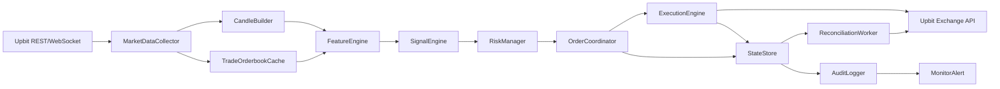

# UFS-R1 자동매매 시스템 개발 스펙

작성일: 2026-05-30  
대상 문서:

- `upbit_auto_trading_strategy_spec.md`
- `docs/image_concepts_and_factcheck.md`
- `docs/ufs-r1_strategy.md`
- `docs/upbit_api_and_trading_system.md`
- `docs/backtest_and_paper_trading.md`
- `docs/risk_controls_and_final_decision.md`

## 1. 개발 목표

업비트 KRW 현물 시장에서 `UFS-R1` 전략을 실행할 수 있는 자동매매 시스템을 개발한다.

`UFS-R1`은 이미지 기반 매매 개념인 FVG, OB, 추세선, 채널, Fake out/Trap을 업비트 API로 관측 가능한 데이터만 사용해 수치화한 전략이다. 단, 수익 보장을 목표로 하지 않으며, 실거래보다 주문 안전성, 손실 제한, 장애 복구, 검증 가능성을 우선한다.

## 2. 핵심 원칙

| 원칙 | 설명 |
|---|---|
| 안전장치 우선 | 신호 점수가 높아도 hard block, 데이터 품질, 리스크 제한을 통과하지 못하면 주문하지 않는다. |
| 현물 롱 전용 | 신규 숏 포지션은 만들지 않는다. 하락 신호는 청산, 회피, 비중 축소에 사용한다. |
| 거래소 상태 우선 | 주문, 체결, 잔고의 최종 진실은 업비트 REST 조회와 체결 이벤트다. |
| 재현 가능성 | 백테스트, 페이퍼, 실거래가 같은 Feature/Signal 로직을 사용해야 한다. |
| 보수적 운영 | 손절은 client-side stop 한계를 전제로 watchdog, 알림, 복구 절차를 함께 둔다. |
| 숫자 정밀도 | 주문, 잔고, 체결, 수수료, PnL은 `float`가 아니라 `Decimal` 또는 정수 최소 단위로 처리한다. |

## 3. 운영 모드

| 모드 | 실제 주문 | 목적 |
|---|---:|---|
| `BACKTEST` | 아니오 | 과거 캔들/호가 로그로 전략 검증 |
| `PAPER` | 아니오 | 실제 업비트 실시간 데이터와 사용자가 설정한 가상 KRW 현금으로 모의 주문, 체결, 포지션, 손익, 손절/익절을 검증 |
| `DRY_RUN` | 아니오 | 실제 주문 직전까지 실행하되 주문 API 호출은 막고 주문 요청 형식과 거래소 제약을 검증 |
| `LIVE` | 예 | 검증 완료 후 제한된 실거래 |
| `RECOVERY_ONLY` | 아니오 | 장애/재시작 후 상태 대조와 복구만 수행 |
| `KILL_SWITCHED` | 아니오 | 신규 주문 금지, 열린 주문 정리와 알림만 수행 |

초기 기본 실행 모드는 `PAPER`다. 외부 데이터 정책은 기본값을 `UPBIT_ONLY`로 둔다. 김치프리미엄, 뉴스, 환율 같은 외부 데이터는 `EXTERNAL_OPTIONAL` 또는 `EXTERNAL_REQUIRED`로 명시적으로 켠 경우에만 hard block 후보가 된다.

초기 사용자 결정값:

| 항목 | 값 |
|---|---|
| 실행 환경 | 로컬 PC |
| 기준 통화 | KRW 현금 |
| 기본 테스트 방식 | 실제 업비트 실시간 데이터 + 가상 KRW 잔고 기반 PAPER 매매 |
| 거래 대상 | KRW 마켓 거래대금 상위 알트 10개 |
| 메이저 마켓 | 초기 기본값에서는 BTC/ETH 제외 |
| 외부 데이터 | `UPBIT_ONLY` |
| 알림 | 내부 알림/화면은 유지, 외부 채널 연동은 보류 |
| 위험 결정 | 킬스위치, 재개 승인, 긴급 청산은 사용자 수동 결정 |

## 4. 시스템 아키텍처



실시간 실행 우선순위는 아래 순서를 따른다.

```text
KillSwitch > Recovery > CircuitBreaker > Reconciliation > Risk > DataQuality > Signal > Execution
```

## 5. 개발 범위

### 5.1 P0: 실거래 안전 기반

P0는 전략 수익성과 무관하게 반드시 먼저 구현해야 하는 범위다.

| 항목 | 요구사항 | 완료 기준 |
|---|---|---|
| 주문 중복 방지 | `client_order_key`와 업비트 `identifier`를 분리 관리한다. 주문 제출 전 `identifier`, 요청 해시, 의도 수량/금액을 영속 저장한다. | timeout 또는 응답 유실 상황에서 같은 마켓 신규 진입이 차단된다. |
| 주문 상태 머신 | `PLANNED`, `SUBMITTING`, `UNKNOWN`, `ACCEPTED`, `PARTIALLY_FILLED`, `FILLED`, `CANCELLED`, `REJECTED`, `RECONCILED` 상태를 지원한다. | 모든 전이가 `ExecutionEvent`로 기록된다. |
| 손절 보호 | 진입 체결 직후 손절 감시 상태를 만든다. `max_unprotected_position_sec` 초과 시 신규 진입을 막고 알림을 보낸다. | 열린 포지션이 보호 없이 방치되지 않는다. |
| 리스크 매니저 | 일 손실, 연속 손절, 종목별 노출, 전체 코인 노출, 상관 노출, 물타기 금지를 검사한다. | 제한 초과 시 주문이 생성되지 않는다. |
| 킬스위치 | 운영자가 수동으로 모든 신규 주문을 중단할 수 있다. | 킬스위치 상태에서 신규 주문이 0건이다. |
| 숫자 정밀도 | 주문/잔고/체결/수수료/PnL 계산에 `Decimal` 또는 정수 최소 단위를 사용한다. | 호가 단위, 최소 주문금액, 수수료 반영 테스트를 통과한다. |
| 복구/대조 | 재시작 시 REST로 잔고, 미체결 주문, 주문 상세를 조회하고 거래소 상태를 우선한다. | 복구 완료 전 신규 주문이 생성되지 않는다. |

### 5.2 P1: 데이터와 검증 기반

| 항목 | 요구사항 | 완료 기준 |
|---|---|---|
| 시장 데이터 수집 | 1m/5m/15m 캔들, trade, orderbook, ticker를 수집한다. | WebSocket 단절 후 REST 보정이 동작한다. |
| 캔들 정합성 | `market + timeframe + candle_date_time` 기준 upsert, synthetic candle 플래그, 확정 grace를 적용한다. | 중복/누락 캔들 상황에서 신호 시점이 왜곡되지 않는다. |
| 데이터 품질 차단 | stale 데이터, REST/WebSocket 불일치, 캔들 보정 실패 시 신규 진입을 금지한다. | `DATA_MISMATCH` 상태에서 주문이 생성되지 않는다. |
| 시장 이벤트 필터 | 유의종목, 주의 경보, 상장폐지/거래지원 종료, 입출금/거래 장애를 hard block으로 처리한다. | 위험 자산 목록 편입 시 신규 매수가 금지된다. |
| 백테스트 엔진 | 실거래와 같은 Feature/Signal 로직을 과거 데이터에 적용한다. | 룩어헤드 바이어스, 피벗 확정 시점, 비용 모델 테스트를 통과한다. |
| 페이퍼 트레이딩 | 실시간 데이터와 가상 KRW 잔고로 주문 상태 머신, 가상 체결, 포지션, 손절 감시, 장애 복구를 검증한다. | 최소 4주 또는 200개 신호에서 주문/리스크 오류 0건이고, 실제 주문 API 호출은 0건이다. |

### 5.3 P2: 전략 검출기와 점수화

| 항목 | 요구사항 | 완료 기준 |
|---|---|---|
| FVG 검출기 | 3캔들 OHLCV 불균형으로 bullish/bearish FVG를 계산한다. | synthetic candle은 FVG 생성에 사용하지 않는다. |
| OB 검출기 | 강한 변동 이전 마지막 반대색 캔들, 구조 돌파, 거래량 조건으로 OB 후보를 만든다. | 기관/세력 의도 같은 검증 불가능한 표현을 로직에 넣지 않는다. |
| Pivot/구조 돌파 | 좌우 `pivot_left/right` 확정 이후 피벗 고점/저점을 계산한다. | 미래 캔들 정보를 미리 쓰지 않는다. |
| Fake out/Trap | 기준 레벨 이탈 후 `reclaim_window` 안의 종가 복귀를 검출한다. | 하방 trap은 롱 후보, 상방 trap은 청산/회피 후보로 분리된다. |
| 채널/추세 필터 | 회귀 채널, EMA20/EMA60, 피벗 기반 추세를 계산한다. | 하락 채널 또는 중심선 아래에서는 신규 롱이 제한된다. |
| 점수화 | 설명용 `signal_score`를 계산한다. | 검증 전에는 실거래 확정 기준으로 사용하지 않는다. |

## 6. 주요 모듈 명세

### 6.1 MarketDataCollector

- 업비트 공개 WebSocket으로 ticker, trade, orderbook, candle을 수신한다.
- REST API로 누락 캔들을 보정한다.
- heartbeat, reconnect, stale timeout을 관리한다.
- 이벤트에는 `exchange_ts`, `received_ts`, `processed_seq`를 기록한다.

### 6.2 CandleBuilder / CandleStore

- 1m, 5m, 15m OHLCV를 저장한다.
- 동일 캔들 시간의 갱신 이벤트는 upsert한다.
- 거래가 없어 생성되지 않은 구간은 필요 시 `synthetic=true` 캔들로 보정한다.
- synthetic candle은 EMA/ATR 같은 연속 지표에만 사용하고 FVG, OB, Trap 생성에는 사용하지 않는다.

### 6.3 FeatureEngine

계산 대상:

- ATR(14)
- EMA20, EMA60
- 거래량 SMA
- 피벗 고점/저점
- 회귀 채널
- FVG Zone
- OB Zone
- Fake out/Trap
- orderbook imbalance
- 예상 슬리피지

### 6.4 SignalEngine

- hard block을 직접 우회하지 않는다.
- 신호는 `Signal`과 `TradePlan`으로 분리한다.
- 진입 조건은 다음 순서로 평가한다.

```text
Hard Block -> Data Quality -> Pattern Expectancy -> Risk Sizing -> Execution
```

기본 롱 후보 조건:

```text
hard_block_pass == true
data_quality_pass == true
trap_confirmed == true
zone_not_invalidated == true
risk_reward_to_target >= 1.5
validated_pattern_expectancy_pass == true
```

### 6.5 RiskManager

- `risk_per_trade`: 계정 평가금액의 0.5%
- `max_daily_loss`: 계정 평가금액의 2%
- `max_open_positions`: 3개
- `max_symbol_exposure`: 25%
- `max_total_crypto_exposure`: 60%
- `max_correlated_exposure`: 35%

진입 전 반드시 검사할 항목:

- 일 손실 한도
- 연속 손절
- 동일 마켓 열린 포지션/미확정 주문
- 잔고와 locked 금액 동기화
- 예상 슬리피지
- 최소 주문금액
- 호가 단위
- API 권한
- 유의종목/주의 경보

### 6.6 OrderCoordinator / ExecutionEngine

- `OrderCoordinator`는 신호를 주문 의도로 바꾸고 중복 주문을 차단한다.
- `ExecutionEngine`은 업비트 주문 생성, 취소, 조회 API를 호출한다.
- 주문 생성 응답을 받지 못하면 `UNKNOWN`으로 저장하고 즉시 재주문하지 않는다.
- 같은 마켓에 `UNKNOWN`, `SUBMITTING`, `PARTIALLY_FILLED` 주문이 있으면 신규 진입을 금지한다.
- 시장가 주문은 유동성, 슬리피지, API 상태가 모두 정상일 때만 제한적으로 허용한다.

업비트 주문 형식:

| 주문 | 업비트 요청 |
|---|---|
| 시장가 매수 | `side=bid`, `ord_type=price`, `price=KRW 주문금액`, `volume` 제외 |
| 시장가 매도 | `side=ask`, `ord_type=market`, `volume=매도수량`, `price` 제외 |
| 지정가 | KRW 마켓 호가 단위 보정, 최소 주문금액 이상 |

### 6.7 StateStore / AuditLogger

`StateStore`는 현재 상태를 저장하고, `AuditLogger`는 변경 이력을 append-only로 저장한다.

필수 저장 대상:

- Candle
- Zone
- Signal
- TradePlan
- OrderIntent
- OrderState
- Fill
- PositionState
- ExecutionEvent
- RiskState
- CircuitBreakerState

로그에 저장하면 안 되는 값:

- API Secret
- JWT
- nonce 원문
- query hash 원문
- 출금 권한이 포함된 키 정보

### 6.8 ReconciliationWorker / RecoveryManager

- 주기적으로 로컬 주문/포지션과 업비트 상태를 대조한다.
- 로컬과 거래소 상태가 다르면 거래소 상태를 우선한다.
- 불일치는 `reconciliation_mismatch` 감사 로그로 남긴다.
- 재시작 시 `RECOVERY_ONLY` 모드로 시작하고, 복구 완료 전까지 신규 주문을 금지한다.

## 7. 데이터 모델 초안

```python
from decimal import Decimal

Money = Decimal
Price = Decimal
Quantity = Decimal
Ratio = Decimal

class Candle:
    market: str
    timeframe: str
    ts: int
    open: Price
    high: Price
    low: Price
    close: Price
    volume: Quantity
    value: Money
    synthetic: bool

class Zone:
    market: str
    kind: str
    direction: str
    low: Price
    high: Price
    state: str
    boundary_mode: str
    source_candle_ids: list[str]
    created_ts: int
    confirmed_ts: int
    expires_ts: int
    score: int

class Signal:
    signal_id: str
    market: str
    side: str
    reason: list[str]
    entry: Price
    stop: Price
    targets: list[Price]
    confidence: Ratio
    invalidation: list[str]

class OrderState:
    client_order_key: str
    exchange_order_id: str | None
    exchange_identifier: str | None
    market: str
    side: str
    status: str
    requested_volume: Quantity
    filled_volume: Quantity
    remaining_volume: Quantity
    avg_fill_price: Price | None
    last_error: str | None
    updated_ts: int

class PositionState:
    market: str
    status: str
    volume: Quantity
    avg_entry_price: Price
    stop_price: Price
    realized_pnl: Money
    unrealized_pnl: Money
    updated_ts: int
```

## 8. 기본 파라미터

| 파라미터 | 기본값 |
|---|---:|
| `timeframe_entry` | 5m |
| `timeframe_filter` | 15m |
| `atr_period` | 14 |
| `pivot_left` / `pivot_right` | 2 / 2 |
| `min_gap_pct` | 0.0015 |
| `min_gap_atr` | 0.25 |
| `impulse_atr_mult` | 1.2 |
| `volume_mult` | 1.3 |
| `break_threshold` | 0.0008 |
| `reclaim_window` | 3 |
| `wick_ratio_min` | 0.45 |
| `risk_per_trade` | 0.5% |
| `max_daily_loss` | 2% |
| `max_spread_pct` | 0.20% |
| `candle_grace_ms` | 1500 |
| `stale_timeout_ms` | 5000 |
| `min_stop_pct` | 0.20% |
| `max_stop_pct` | 2.00% |
| `entry_timeout_sec` | 20 |
| `max_unprotected_position_sec` | 10 |
| `external_risk_mode` | `UPBIT_ONLY` |
| `paper_initial_cash_krw` | 사용자 설정 |
| `paper_virtual_trading_enabled` | true |
| `paper_allow_real_order_api` | false |
| `top_alt_count` | 10 |
| `include_major_markets` | false |

## 9. 진입, 손절, 익절 규칙

### 9.1 진입

- 기본 진입은 fake out 회복 캔들의 종가 이후 지정가 주문이다.
- 시장가 신규 진입은 예상 슬리피지, 호가 잔량, API 상태, 일 손실 한도가 모두 정상일 때만 제한적으로 허용한다.
- 공격형 선진입은 사용하지 않는다.

### 9.2 손절

```text
stop = min(fakeout_low, ob_low, fvg_low) - ATR(14) * 0.1
```

- 손절 폭이 `min_stop_pct`보다 작으면 진입 금지.
- 손절 폭이 `max_stop_pct`보다 크면 포지션 크기를 축소하고, 최소 주문금액 미만이면 진입 금지.
- 급락으로 손절가를 건너뛰면 지정가를 고집하지 않고 긴급 청산 규칙을 사용한다.

### 9.3 익절

- 1R 도달: 50% 매도, 손절가를 수수료 포함 손익분기점으로 이동.
- 2R 도달: 30% 추가 매도.
- 잔여 20%는 trailing stop으로 관리한다.
- 상방 fake out이 확인되면 잔여 물량을 청산한다.

## 10. 검증 기준

### 10.1 백테스트

- 대상: 각 시점의 KRW 마켓 거래대금 상위 알트 10개. 초기 기본값에서는 BTC/ETH는 제외한다.
- 기간: 최소 6개월 이상.
- 데이터: 1분/5분 캔들, 가능하면 호가 로그.
- 비용: 수수료, spread, 슬리피지, 부분 체결, 미체결 취소, 호가 단위, 최소 주문금액.
- 금지: 룩어헤드 바이어스, 미래 피벗 사용, 현재 기준 거래대금 상위 종목 고정.

합격 기준:

- 비용 차감 기대값이 양수다.
- 워크포워드 테스트 윈도우 중 70% 이상에서 기대값이 양수다.
- 특정 1~2개 종목 또는 1주일 성과에 총수익의 50% 이상이 집중되지 않는다.
- 파라미터 +/-20% 범위에서도 기대값이 유지된다.

### 10.2 패턴 이벤트 스터디

실거래 후보로 승격하려면 각 패턴별로 다음 조건을 만족해야 한다.

- 검증 거래 수 200건 이상.
- 수수료와 슬리피지를 뺀 기대값이 0보다 큼.
- 부트스트랩 95% 신뢰구간을 기록.
- 같은 종목, 시간대, 변동성 분위의 무작위 이벤트와 비교해 초과 성과가 있음.

### 10.3 페이퍼 트레이딩

- 기간: 최소 4주 이상 또는 200개 이상 신호.
- 주문 실패, 중복 주문, 잔고 불일치, 손절 누락 0건.
- 실시간 신호와 백테스트 재현 결과 99% 이상 일치.
- 장애 주입, 재시작 복구, 부분 체결, 취소 실패 테스트 통과.

### 10.4 소액 실거래

- 백테스트와 페이퍼 기준을 모두 통과한 뒤에만 진행한다.
- 첫 2주간 `risk_per_trade`를 0.1%로 축소한다.
- 주문 타입, 호가 단위, 최소 주문금액, 권한 오류, 체결 지연을 검증한다.

## 11. 장애 대응 요구사항

| 상황 | 동작 |
|---|---|
| REST 429 | 지수 백오프, 요청 속도 감소 |
| REST 418 | 응답의 차단 시간 동안 거래 중단 |
| 주문 timeout | `UNKNOWN` 저장, 즉시 재주문 금지, 거래소/잔고/locked 대조 |
| WebSocket 단절 | REST 보정, stale 기준 초과 시 신규 진입 중단 |
| 데이터 불일치 | `DATA_MISMATCH` 상태, 해당 마켓 신규 주문 금지 |
| 부분 체결 | 체결 수량만 포지션 반영, 남은 수량은 timeout 후 취소 |
| 취소 실패 | 주문 조회 후 최대 `cancel_retry_max`회 재시도, 실패 시 신규 진입 중단 |
| 재시작 | `RECOVERY_ONLY`로 시작, 거래소 상태 기준 복구 완료 후 재개 |
| 손절 감시 누락 | 신규 진입 금지, 긴급 알림, 수동 청산 절차 실행 |

## 12. 보안 요구사항

- API 키는 조회, 주문 조회, 주문하기에 필요한 최소 권한만 부여한다.
- 출금 권한은 사용하지 않는다.
- Secret, JWT, nonce, query hash는 로그에 남기지 않는다.
- 운영 서버 시간은 NTP 등으로 동기화한다.
- 실거래 설정 파일과 API 키는 저장소에 커밋하지 않는다.
- 운영자는 수동 킬스위치와 긴급 청산 절차를 문서로 확인할 수 있어야 한다.
- `PAPER` 모드에서는 실제 주문 API 호출을 코드와 설정 양쪽에서 차단한다.

## 13. 개발 마일스톤

| 단계 | 목표 | 산출물 |
|---|---|---|
| 1 | 프로젝트 뼈대와 설정 | 실행 모드, 설정 로더, 로깅, Decimal 유틸 |
| 2 | 데이터 수집 | REST/WebSocket 수집기, 캔들 저장소, 데이터 품질 검사 |
| 3 | 상태 저장과 주문 안전 | StateStore, AuditLog, 주문 상태 머신, 중복 주문 방지 |
| 4 | 리스크/킬스위치 | RiskManager, CircuitBreaker, KillSwitch |
| 5 | 전략 Feature | ATR/EMA/Pivot/FVG/OB/Trap/Channel 계산 |
| 6 | 백테스트 | 비용 모델, 룩어헤드 방지, 이벤트 스터디 |
| 7 | 페이퍼 | 실시간 시세 기반 가상 잔고 매매, 장애 주입, 복구 검증 |
| 8 | DRY_RUN/소액 실거래 | 실제 주문 형식 검증, 최소 금액 테스트 |
| 9 | 제한적 LIVE | 축소 리스크 실거래, 모니터링, 운영 절차 |

## 14. 비범위

초기 버전에서는 다음을 구현하지 않는다.

- 선물, 마진, 숏 포지션.
- 수익률 보장 또는 목표 승률 보장.
- 검증 전 `signal_score_threshold`만으로 실거래 진입.
- 기관 주문, 세력 의도, 스탑 헌팅 원인 자체의 직접 추정.
- 외부 뉴스/김치프리미엄 hard block을 기본값으로 강제.
- 손실 중인 포지션 물타기.

## 15. 완료 정의

개발 완료는 단순히 코드가 실행되는 상태가 아니다. 다음 조건을 모두 만족해야 한다.

- P0 안전 요구사항이 자동 테스트로 검증된다.
- 백테스트와 페이퍼가 같은 Feature/Signal 로직을 사용한다.
- 페이퍼가 실제 업비트 시세를 사용해 가상 KRW 잔고, 가상 체결, 포지션, 손익을 갱신한다.
- 주문 timeout, 부분 체결, 취소 실패, 재시작 복구 시나리오가 테스트된다.
- 실거래 전 `DRY_RUN`에서 주문 요청 원문, 호가 단위, 최소 주문금액, 권한 오류가 검증된다.
- 감사 로그로 모든 신호, 탈락 사유, 주문 의도, 주문 응답, 체결, 취소, 오류를 추적할 수 있다.
- 운영자가 현재 모드, 차단 사유, 열린 포지션, 미확정 주문, 일 손익, 킬스위치 상태를 확인할 수 있다.
