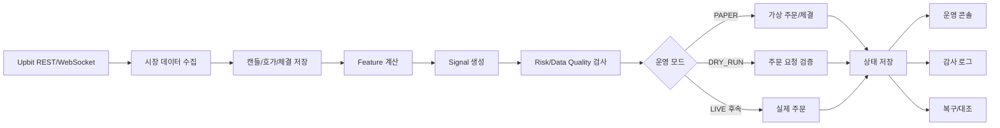
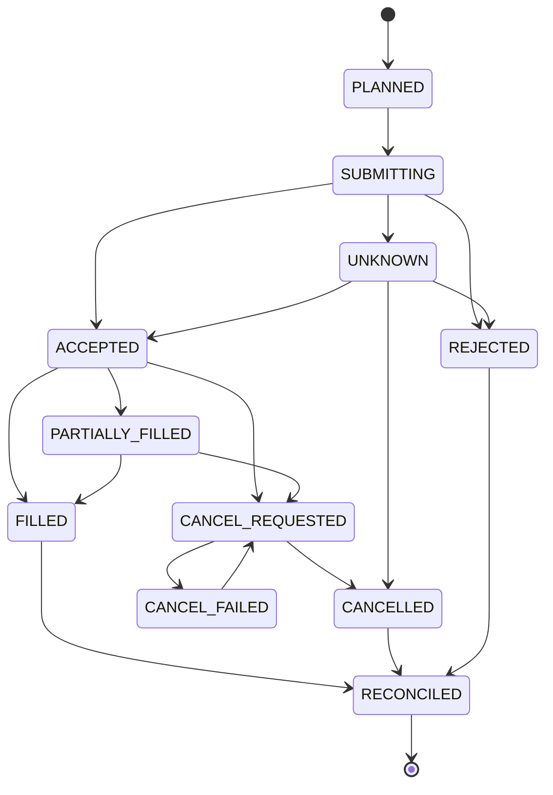

# UFS-R1 자동매매 시스템 기능명세서

작성일: 2026-05-31  
기준 문서:

- `docs/development_spec.md`
- `docs/development_plan.md`
- `docs/upbit_api_and_trading_system.md`
- `docs/ufs-r1_strategy.md`
- `docs/backtest_and_paper_trading.md`
- `docs/risk_controls_and_final_decision.md`
- `docs/image_concepts_and_factcheck.md`

## 1. 문서 목적

이 문서는 `UFS-R1` 자동매매 프로젝트에서 실제로 구현하고 사용할 기능을 한곳에 정리한 기능명세서다.

개발자가 아닌 사용자도 이해할 수 있도록 기능 단위로 설명하며, 각 기능이 왜 필요한지, 어떤 입력과 출력이 있는지, 완료 기준은 무엇인지 정의한다.

## 2. 프로젝트 한 줄 요약

업비트 KRW 현물 시장에서 `UFS-R1` 전략을 먼저 `PAPER` 모드로 안전하게 검증하고, 운영자가 웹 콘솔에서 봇 상태, 주문, 포지션, 리스크, 장애를 확인하고 제어할 수 있는 자동매매 운영 시스템을 만든다.

## 3. 핵심 원칙

| 원칙 | 의미 |
|---|---|
| 안전장치 우선 | 신호가 좋아도 리스크, 데이터 품질, 거래소 상태가 나쁘면 주문하지 않는다. |
| 실거래 전 검증 | 첫 목표는 `LIVE`가 아니라 실제 업비트 시세 기반 `PAPER` 운영이다. |
| 현물 롱 전용 | 신규 숏 포지션은 만들지 않는다. 하락 신호는 매도, 회피, 비중 축소에 쓴다. |
| 거래소 상태 우선 | 주문, 체결, 잔고의 최종 기준은 업비트 REST 조회와 체결 이벤트다. |
| 재현 가능성 | 백테스트, 페이퍼, 실거래가 같은 Feature/Signal 로직을 사용해야 한다. |
| 숫자 정밀도 | 돈, 수량, 수수료, 손익 계산에는 `float`를 쓰지 않는다. |
| 비밀 보호 | API Secret, JWT, nonce, query hash는 로그나 화면에 노출하지 않는다. |

## 4. 사용자와 역할

| 역할 | 설명 | 주요 기능 |
|---|---|---|
| 운영자 | 봇을 켜고 상태를 확인하는 사용자 | 모드 확인, 킬스위치, 복구 실행, 알림 확인, 페이퍼 설정 |
| 전략 검증자 | 전략 성능과 검증 결과를 보는 사용자 | 백테스트, 이벤트 스터디, 페이퍼 성과, 승격 조건 확인 |
| 시스템 | 자동으로 데이터를 수집하고 판단하는 백엔드 | 데이터 수집, 신호 생성, 주문 차단, 복구, 감사 로그 |

초기 릴리스에서는 운영자와 전략 검증자가 같은 사람일 수 있다.

## 5. 1차 릴리스 범위

1차 릴리스 목표는 `PAPER + 운영 콘솔`이다.

| 구분 | 포함 여부 | 설명 |
|---|---:|---|
| 실제 업비트 실시간 데이터 수집 | 포함 | ticker, trade, orderbook, candle 데이터를 수집한다. |
| 가상 KRW 잔고 기반 PAPER 매매 | 포함 | 실제 주문 없이 가상 주문, 체결, 포지션, 손익을 갱신한다. |
| 운영자 웹 콘솔 | 포함 | 상태, 주문, 포지션, 차단 사유, 알림, 감사 로그를 본다. |
| 킬스위치 | 포함 | 운영자가 신규 주문을 즉시 중단한다. |
| 복구/대조 | 포함 | 재시작 또는 불일치 발생 시 거래소 상태 기준으로 복구한다. |
| DRY_RUN 주문 검증 | 포함 | 실제 주문 API 호출 없이 요청 형식과 거래소 제약을 검증한다. |
| 전략 검출기 | 부분 포함 | FVG, OB, Trap 등은 P0 안전 기반 이후 구현한다. |
| LIVE 실거래 | 제외 | 별도 승인과 검증 이후 후속 릴리스에서 연다. |
| 선물/마진/숏 | 제외 | 업비트 KRW 현물 롱 전용으로 시작한다. |
| 외부 뉴스/김치프리미엄 hard block | 제외 | 초기 기본값은 `UPBIT_ONLY`다. |

## 6. 전체 흐름



실시간 판단 우선순위는 아래 순서를 따른다.

```text
KillSwitch > Recovery > CircuitBreaker > Reconciliation > Risk > DataQuality > Signal > Execution
```

앞 단계에서 차단되면 뒤 단계는 주문을 만들 수 없다.

## 7. 운영 모드 기능

### 7.1 지원 모드

| 모드 | 실제 주문 | 설명 |
|---|---:|---|
| `BACKTEST` | 아니오 | 과거 데이터로 전략을 검증한다. |
| `PAPER` | 아니오 | 실제 업비트 실시간 데이터와 가상 KRW 잔고로 모의 매매한다. |
| `DRY_RUN` | 아니오 | 실제 주문 직전까지 실행하되 주문 API 호출은 막는다. |
| `LIVE` | 예 | 검증 완료 후 제한적으로 여는 실거래 모드다. 1차 릴리스에서는 비활성이다. |
| `RECOVERY_ONLY` | 아니오 | 복구와 대조만 수행하고 신규 주문은 금지한다. |
| `KILL_SWITCHED` | 아니오 | 신규 주문을 금지하고 열린 주문 정리와 알림만 수행한다. |

### 7.2 운영 모드 요구사항

| ID | 기능 | 요구사항 | 완료 기준 |
|---|---|---|---|
| MODE-01 | 기본 모드 | 최초 실행 기본값은 `PAPER`다. | 설정 없이 실행하면 실제 주문 API가 호출되지 않는다. |
| MODE-02 | 모드 표시 | 콘솔에서 현재 모드와 신규 주문 가능 여부를 표시한다. | 운영자가 한 화면에서 현재 모드를 확인한다. |
| MODE-03 | RECOVERY_ONLY 진입 | 재시작 시 복구가 필요하면 `RECOVERY_ONLY`로 시작한다. | 복구 완료 전 신규 주문이 생성되지 않는다. |
| MODE-04 | KILL_SWITCHED 진입 | 킬스위치가 켜지면 신규 주문이 즉시 차단된다. | 킬스위치 상태에서 신규 주문 0건이다. |
| MODE-05 | LIVE 잠금 | 1차 릴리스에서는 `LIVE` 실제 주문 실행을 설정과 코드 양쪽에서 막는다. | `LIVE` 실주문 경로가 테스트에서 차단된다. |

## 8. 시장 데이터 기능

### 8.1 수집 대상

| 데이터 | 출처 | 용도 |
|---|---|---|
| ticker | Upbit WebSocket/REST | 현재가, 거래대금, 상태 확인 |
| trade | Upbit WebSocket | 체결 흐름, 거래량, 신호 보조 |
| orderbook | Upbit WebSocket | 스프레드, 예상 슬리피지, 호가 불균형 |
| 1m/5m/15m candle | Upbit WebSocket/REST | 전략 계산과 백테스트 |
| market detail | Upbit REST | 유의종목, 주의 경보, 거래 가능 여부 |

### 8.2 기능 요구사항

| ID | 기능 | 요구사항 | 완료 기준 |
|---|---|---|---|
| DATA-01 | WebSocket 수집 | ticker, trade, orderbook, candle을 실시간 수신한다. | 마지막 수신 시각이 콘솔에 표시된다. |
| DATA-02 | REST 보정 | WebSocket 누락 또는 재연결 후 REST로 캔들을 보정한다. | 누락 구간이 보정되고 감사 로그가 남는다. |
| DATA-03 | 캔들 upsert | 같은 `market + timeframe + candle_date_time`은 갱신 저장한다. | 중복 캔들이 신호를 중복 생성하지 않는다. |
| DATA-04 | synthetic candle | 체결이 없는 구간은 필요 시 `synthetic=true`로 보정한다. | synthetic candle은 FVG/OB/Trap 생성에 쓰이지 않는다. |
| DATA-05 | 확정 grace | 캔들은 마감 후 `candle_grace_ms`가 지나야 신호에 사용한다. | 마감 전 캔들로 신호가 생성되지 않는다. |
| DATA-06 | stale 감지 | `stale_timeout_ms` 이상 갱신이 없으면 신규 진입을 막는다. | `DATA_STALE` 차단 사유가 생성된다. |
| DATA-07 | REST/WebSocket 불일치 | 가격 또는 캔들이 허용 오차 이상 다르면 해당 마켓을 차단한다. | `DATA_MISMATCH` 상태에서 주문이 생성되지 않는다. |
| DATA-08 | 시각 기록 | 이벤트마다 `exchange_ts`, `received_ts`, `processed_seq`를 저장한다. | 장애 분석 시 이벤트 순서를 재구성할 수 있다. |

## 9. 거래 대상 선정 기능

| ID | 기능 | 요구사항 | 완료 기준 |
|---|---|---|---|
| MARKET-01 | KRW 현물 제한 | KRW 현물 마켓만 거래 대상으로 사용한다. | KRW가 아닌 마켓은 후보에서 제외된다. |
| MARKET-02 | 상위 알트 선정 | 최근 24시간 거래대금 상위 알트 10개를 기본 대상으로 한다. | `top_alt_count=10` 기준 후보 목록이 생성된다. |
| MARKET-03 | 메이저 제외 | 초기 기본값에서는 BTC/ETH를 제외한다. | `include_major_markets=false`일 때 BTC/ETH가 빠진다. |
| MARKET-04 | 유의종목 차단 | `market_event.warning` 또는 caution 경보가 있으면 신규 매수 금지다. | 위험 종목에서 신규 매수 주문이 0건이다. |
| MARKET-05 | 유동성 검사 | 스프레드와 예상 슬리피지가 기준을 넘으면 시장가 신규 진입을 막는다. | `SPREAD_TOO_WIDE` 또는 `SLIPPAGE_LIMIT` 차단 사유가 남는다. |

## 10. 전략 신호 기능

전략명은 `UFS-R1`, 의미는 `Upbit FVG-Sweep Reversion v1`이다.

전략은 아래 개념을 업비트 데이터로 계산 가능한 규칙으로 바꿔 사용한다.

| 개념 | 자동화 해석 | 사용 방식 |
|---|---|---|
| FVG | 3캔들 OHLCV 불균형 | 진입 후보 구역 |
| OB | 강한 변동 전 마지막 반대색 캔들 + 구조 돌파 | 진입 후보 구역 |
| Fake out/Trap | 기준 레벨 이탈 후 N캔들 내 종가 복귀 | 핵심 진입 트리거 |
| 추세선 | 피벗 기반 회귀선 또는 피벗 연결 | 방향 필터 |
| 채널 | 회귀 채널 | 진입/익절 보조 필터 |
| 호가 불균형 | 상위 호가 잔량 비율 | 검증 전에는 참고 필터 |

### 10.1 Feature 계산

| ID | 기능 | 요구사항 | 완료 기준 |
|---|---|---|---|
| STRAT-01 | ATR/EMA | ATR(14), EMA20, EMA60을 계산한다. | 지표가 캔들 마감 기준으로 갱신된다. |
| STRAT-02 | Pivot | `pivot_left/right` 확정 이후 피벗 고점/저점을 계산한다. | 미래 캔들을 미리 쓰지 않는다. |
| STRAT-03 | FVG | bullish/bearish FVG를 3캔들 규칙으로 검출한다. | 최소 폭 조건과 synthetic 제외 조건을 통과한다. |
| STRAT-04 | OB 후보 | impulse 전 마지막 반대색 캔들과 구조 돌파를 기준으로 OB 후보를 만든다. | "세력 의도" 같은 검증 불가능한 값은 쓰지 않는다. |
| STRAT-05 | Trap | 기준 레벨 이탈 후 `reclaim_window` 안의 복귀를 검출한다. | 하방 trap은 롱 후보, 상방 trap은 청산/회피 후보로 분리된다. |
| STRAT-06 | Channel | 최근 캔들 회귀 중심선과 밴드를 계산한다. | 하락 채널 중심선 아래에서는 신규 롱을 제한한다. |
| STRAT-07 | Zone 상태 | FVG/OB/지지저항을 Zone 상태 머신으로 관리한다. | `filled`, `invalidated`, `expired` Zone은 진입 근거로 쓰지 않는다. |

### 10.2 신호 생성

진입 판단은 다음 순서로 한다.

```text
Hard Block -> Data Quality -> Pattern Expectancy -> Risk Sizing -> Execution
```

롱 후보의 기본 조건은 다음과 같다.

```text
hard_block_pass == true
data_quality_pass == true
trap_confirmed == true
zone_not_invalidated == true
risk_reward_to_target >= 1.5
validated_pattern_expectancy_pass == true
```

| ID | 기능 | 요구사항 | 완료 기준 |
|---|---|---|---|
| SIGNAL-01 | Signal 생성 | 조건을 만족한 경우 `Signal`을 만든다. | 신호에는 이유, 진입가, 손절가, 목표가, 무효화 조건이 포함된다. |
| SIGNAL-02 | TradePlan 생성 | 신호와 주문 의도를 분리한다. | 주문 전 단계에서 리스크 검사 결과를 확인할 수 있다. |
| SIGNAL-03 | 점수화 | `signal_score`는 후보 정렬과 설명용으로만 사용한다. | hard block이 있으면 점수와 무관하게 주문하지 않는다. |
| SIGNAL-04 | 검증 근거 | 실거래 후보가 되려면 패턴별 기대값과 표본 수를 기록한다. | 200건 미만 검증 패턴은 LIVE 후보에서 제외된다. |

## 11. 리스크 관리 기능

### 11.1 기본 제한값

| 항목 | 기본값 |
|---|---:|
| `risk_per_trade` | 계정 평가금액의 0.5% |
| `max_daily_loss` | 계정 평가금액의 2% |
| `max_open_positions` | 3개 |
| `max_symbol_exposure` | 25% |
| `max_total_crypto_exposure` | 60% |
| `max_correlated_exposure` | 35% |
| `max_unprotected_position_sec` | 10초 |

### 11.2 차단 기능

| ID | 기능 | 요구사항 | 완료 기준 |
|---|---|---|---|
| RISK-01 | 일 손실 제한 | 당일 손실이 한도를 넘으면 신규 진입을 중단한다. | `DAILY_LOSS_LIMIT` 차단 사유가 표시된다. |
| RISK-02 | 연속 손절 제한 | 연속 손절 횟수가 기준을 넘으면 거래를 중단한다. | 차단 사유와 재개 조건이 기록된다. |
| RISK-03 | 노출 제한 | 종목별, 전체 코인, 상관 노출을 제한한다. | 제한 초과 주문이 생성되지 않는다. |
| RISK-04 | 동일 마켓 중복 제한 | 같은 마켓에 미확정 주문 또는 열린 포지션이 있으면 신규 진입을 막는다. | `UNKNOWN_ORDER_EXISTS` 등 상태별 차단이 동작한다. |
| RISK-05 | 물타기 금지 | 손실 중인 포지션에는 추가 매수를 하지 않는다. | 손실 포지션 추가 진입 주문이 0건이다. |
| RISK-06 | 보호 없는 포지션 차단 | 손절 감시가 없는 포지션이 기준 시간을 넘으면 신규 진입을 막는다. | `UNPROTECTED_POSITION` 알림과 차단이 생성된다. |
| RISK-07 | 잔고/locked 동기화 | 주문 전 잔고와 locked 금액을 확인한다. | 동기화 실패 시 주문이 생성되지 않는다. |
| RISK-08 | API 권한 검사 | 조회/주문에 필요한 최소 권한을 확인한다. | 권한 오류는 `API_PERMISSION_ERROR`로 표시된다. |

## 12. 주문 안전 기능

### 12.1 주문 상태

```text
PLANNED
SUBMITTING
UNKNOWN
ACCEPTED
PARTIALLY_FILLED
FILLED
CANCEL_REQUESTED
CANCELLED
CANCEL_FAILED
REJECTED
RECONCILED
```

### 12.2 상태 흐름



### 12.3 기능 요구사항

| ID | 기능 | 요구사항 | 완료 기준 |
|---|---|---|---|
| ORDER-01 | 내부 주문 키 | `client_order_key`로 같은 신호의 중복 주문을 막는다. | 같은 키의 활성 주문은 중복 생성되지 않는다. |
| ORDER-02 | 업비트 identifier | 업비트 `identifier`는 주문 제출마다 전역 유일하게 생성한다. | `exchange_identifier`는 저장소에서 UNIQUE다. |
| ORDER-03 | 제출 전 저장 | 주문 API 호출 전 의도, identifier, 요청 해시를 영속 저장한다. | 응답 유실 시에도 주문 의도가 추적된다. |
| ORDER-04 | timeout 처리 | 주문 생성 응답을 받지 못하면 `UNKNOWN`으로 저장한다. | 즉시 재주문하지 않고 대조 절차를 시작한다. |
| ORDER-05 | UNKNOWN 차단 | `UNKNOWN` 주문이 있으면 같은 마켓 신규 진입을 금지한다. | 중복 매수와 과다 노출이 발생하지 않는다. |
| ORDER-06 | 부분 체결 | 부분 체결분만 포지션에 반영하고 남은 수량은 timeout 후 취소한다. | 포지션 수량과 잔여 주문 수량이 일치한다. |
| ORDER-07 | 취소 실패 | 취소 실패 시 주문 조회 후 최대 `cancel_retry_max`회 재시도한다. | 실패하면 `CANCEL_FAILED`와 신규 진입 차단이 남는다. |
| ORDER-08 | 상태 전이 기록 | 모든 상태 전이는 `ExecutionEvent`로 기록한다. | 상태 전이 없는 포지션 변경이 없다. |

## 13. PAPER 매매 기능

`PAPER`는 단순히 신호를 보여주는 모드가 아니다. 실제 업비트 실시간 데이터를 사용하되, 돈과 주문은 가상으로 처리하는 모의 운영 모드다.

| ID | 기능 | 요구사항 | 완료 기준 |
|---|---|---|---|
| PAPER-01 | 가상 KRW 잔고 | 사용자가 설정한 시작 가상 현금을 사용한다. | 콘솔과 API에서 가상 현금 잔고가 보인다. |
| PAPER-02 | 가상 주문 | 실제 주문 API 호출 없이 주문 상태 머신을 실행한다. | `PAPER_ALLOW_REAL_ORDER_API=false`에서 실제 주문 호출 0건이다. |
| PAPER-03 | 가상 체결 | 호가/체결 데이터를 기준으로 가상 체결을 만든다. | 미체결, 부분 체결, 체결 완료 상태가 기록된다. |
| PAPER-04 | 가상 포지션 | 보유 수량, 평균 진입가, 손절가를 갱신한다. | 주문 체결과 포지션 수량이 일치한다. |
| PAPER-05 | 손익 계산 | 수수료를 반영한 실현/미실현 PnL을 계산한다. | 돈 관련 값은 문자열 또는 Decimal 기반으로 표시된다. |
| PAPER-06 | 손절/익절 | 1R/2R 부분 익절, trailing stop, emergency exit를 검증한다. | 포지션 관리 이벤트가 감사 로그에 남는다. |
| PAPER-07 | 리셋 | 운영자가 페이퍼 가상 잔고와 상태 리셋을 요청할 수 있다. | 리셋 요청은 감사 로그에 남고 실제 주문과 무관하다. |

## 14. 손절/익절 기능

### 14.1 손절

초기 손절 계산식은 다음과 같다.

```text
stop = min(fakeout_low, ob_low, fvg_low) - ATR(14) * 0.1
```

| ID | 기능 | 요구사항 | 완료 기준 |
|---|---|---|---|
| EXIT-01 | 손절 폭 검사 | 손절 폭이 너무 작거나 크면 진입을 막거나 수량을 줄인다. | `min_stop_pct`, `max_stop_pct` 기준을 통과한다. |
| EXIT-02 | 손절 감시 | 진입 체결 직후 손절 감시 상태를 만든다. | 보호 없는 포지션 시간이 기준을 넘지 않는다. |
| EXIT-03 | 긴급 청산 | 급락으로 손절가를 건너뛰면 지정가만 고집하지 않는다. | 위험 감소 목적의 청산 규칙이 실행된다. |
| EXIT-04 | 무효화 | Zone 하단 종가 이탈, 상방 fake out, 추세 하락 전환 시 청산/회피한다. | 무효화 사유가 신호와 로그에 남는다. |

### 14.2 익절

| 조건 | 동작 |
|---|---|
| 1R 도달 | 50% 매도, 손절가를 수수료 포함 손익분기점으로 이동 |
| 2R 도달 | 30% 추가 매도 |
| 잔여 20% | trailing stop으로 관리 |
| 상방 fake out | 잔여 물량 청산 |

## 15. 복구와 대조 기능

| ID | 기능 | 요구사항 | 완료 기준 |
|---|---|---|---|
| REC-01 | 재시작 복구 | 재시작 시 신규 주문을 금지하고 상태를 대조한다. | 복구 전까지 신규 주문 0건이다. |
| REC-02 | 잔고 조회 | 업비트 REST로 계정 잔고를 조회한다. | 로컬 포지션과 거래소 잔고 차이가 기록된다. |
| REC-03 | 미체결 조회 | 미완료 주문과 거래소 미체결 주문을 비교한다. | 불일치가 `reconciliation_mismatch`로 남는다. |
| REC-04 | 거래소 우선 | 로컬과 거래소 상태가 다르면 거래소 상태를 우선한다. | 복구 후 상태가 거래소 기준으로 정리된다. |
| REC-05 | 복구 단계 표시 | 잔고 조회, 주문 조회, 포지션 재계산 등 단계별 상태를 표시한다. | 콘솔에서 `pending/running/succeeded/failed/skipped`가 보인다. |
| REC-06 | 재개 제한 | 복구 완료 후에도 운영자 승인 또는 조건 확인 전에는 자동 재개하지 않는다. | 재개 가능 여부와 미충족 조건이 표시된다. |

## 16. 킬스위치와 서킷브레이커 기능

| ID | 기능 | 요구사항 | 완료 기준 |
|---|---|---|---|
| SAFE-01 | 킬스위치 ON | 운영자가 즉시 신규 주문을 중단할 수 있다. | 신규 주문이 0건이고 상태가 화면에 표시된다. |
| SAFE-02 | 킬스위치 해제 요청 | 해제는 조건 확인과 사용자 확인을 거친다. | 해제 요청, 확인자, 사유가 감사 로그에 남는다. |
| SAFE-03 | API 장애 차단 | 429는 지수 백오프, 418은 차단 시간 동안 거래 중단으로 처리한다. | 레이트 리밋 상황에서 신규 주문이 막힌다. |
| SAFE-04 | 데이터 장애 차단 | stale, mismatch, 캔들 보정 실패 시 신규 진입을 막는다. | 차단 코드와 해소 조건이 표시된다. |
| SAFE-05 | 취소 실패 차단 | 취소 실패가 해결될 때까지 신규 진입을 막는다. | `CANCEL_FAILED` 상태가 콘솔과 알림에 보인다. |

## 17. 운영 콘솔 기능

운영 콘솔은 투자자용 매매 화면이 아니라 자동매매 운영 감시 화면이다.

### 17.1 화면 목록

| 화면 | 목적 | 주요 표시 |
|---|---|---|
| 운영 요약 | 지금 봇이 안전한지 확인 | 모드, 킬스위치, 신규 주문 가능 여부, 차단 사유, 일 손익 |
| 주문/포지션 | 주문 상태와 포지션 보호 확인 | 주문 상태, 체결 수량, 평균 진입가, 손절가, PnL |
| 차단 사유/리스크 | 왜 주문하지 않았는지 설명 | hard block, data quality block, risk block |
| 데이터 품질 | 마켓별 데이터 이상 확인 | 마지막 수신 시각, stale, mismatch, synthetic |
| 복구 진행 | 복구 단계와 실패 원인 확인 | 현재 단계, 결과, 재개 가능 여부 |
| 알림/장애 인박스 | 즉시 확인할 이벤트 추적 | 알림 ID, 심각도, 확인자, 조치 상태 |
| 감사 로그 | 모든 판단과 상태 전이 추적 | 이벤트 타입, 이전/이후 상태, 요청/응답 마스킹본 |
| 검증/승격 상태 | 다음 단계로 넘어갈 조건 확인 | 백테스트, 페이퍼, DRY_RUN 조건 |
| 설정 | 안전한 페이퍼 설정 변경 | 가상 현금, 리셋, 대상 종목 수, 메이저 포함 여부 |

### 17.2 화면 공통 요구사항

| ID | 기능 | 요구사항 | 완료 기준 |
|---|---|---|---|
| UI-01 | 현재 상태 우선 | 첫 화면에서 모드, 킬스위치, 차단 사유가 보여야 한다. | 터미널 없이 운영 상태를 파악한다. |
| UI-02 | 가능한 액션 표시 | 상태별 가능한 다음 행동을 API에서 받아 표시한다. | UI가 임의로 판단하지 않는다. |
| UI-03 | 차단 사유 설명 | 차단 코드, 설명, 해소 조건, 운영자 행동을 함께 보여준다. | 사용자가 왜 주문이 막혔는지 이해한다. |
| UI-04 | 민감값 마스킹 | 원문 요청/응답을 보여줄 때 비밀값을 제거한다. | Secret, JWT, nonce, query hash가 보이지 않는다. |
| UI-05 | 감사 로그 연결 | 주문, 알림, 복구 항목에서 관련 로그로 이동할 수 있다. | 문제 발생 흐름을 추적할 수 있다. |

## 18. API 기능

### 18.1 최소 API 목록

```text
GET /api/status
GET /api/orders
GET /api/orders/{order_id}
GET /api/positions
GET /api/risk/blocks
GET /api/data-quality
GET /api/audit-events
GET /api/alerts
GET /api/settings
PATCH /api/settings/paper
POST /api/alerts/{alert_id}/ack
POST /api/kill-switch/enable
POST /api/kill-switch/disable-request
POST /api/kill-switch/disable-confirm
POST /api/recovery/run
GET /api/recovery/runs/{recovery_run_id}
POST /api/dry-run/order
POST /api/paper/reset
```

### 18.2 API 공통 규칙

| 규칙 | 설명 |
|---|---|
| 금액/가격/수량 | 문자열로 반환한다. |
| 상태값 | enum 문자열로 반환한다. |
| 시간 | 모든 응답에 `server_time`을 포함한다. |
| 목록 | 커서 기반 페이지네이션을 지원한다. |
| 오류 | 공통 오류 응답 형식을 사용한다. |
| 민감 정보 | API 응답에 절대 포함하지 않는다. |
| 상태 변경 | `request_id`, `idempotency_key`, `operator_id`, `reason`을 받는다. |

공통 오류 응답 예시는 다음과 같다.

```json
{
  "server_time": "2026-05-31T00:00:00Z",
  "request_id": "req_...",
  "error": {
    "code": "UNKNOWN_ORDER_EXISTS",
    "message": "같은 마켓에 상태 미확정 주문이 있어 신규 주문을 만들 수 없습니다.",
    "retryable": false,
    "details": {}
  }
}
```

## 19. 설정 기능

### 19.1 초기 변경 허용 설정

P0에서는 실제 주문과 직접 연결되지 않는 안전한 값만 화면에서 바꿀 수 있다.

| 설정 | 설명 |
|---|---|
| `PAPER_INITIAL_CASH_KRW` | 페이퍼 시작 가상 KRW 현금 |
| `PAPER_RESET_ON_START` | 시작 시 페이퍼 상태 리셋 여부 |
| `PAPER_ORDER_FILL_MODEL` | 페이퍼 체결 모델 |
| `TOP_ALT_COUNT` | 거래대금 상위 알트 개수 |
| `INCLUDE_MAJOR_MARKETS` | BTC/ETH 포함 여부 |
| `KILL_SWITCH_ON_START` | 시작 시 킬스위치 활성 여부 |

### 19.2 초기 변경 금지 설정

| 설정 | 이유 |
|---|---|
| `LIVE_TRADING_ENABLED` | 실거래 활성은 별도 승인 후 열어야 한다. |
| API 키/Secret | 화면에서 입력하거나 노출하지 않는다. |
| 핵심 리스크 한도 | 실거래 안전에 직접 영향을 주므로 P0에서는 읽기 전용이다. |
| 주문 권한 | API 키 권한과 연결되므로 화면 변경 대상이 아니다. |

## 20. 감사 로그와 알림 기능

### 20.1 감사 로그

감사 로그는 append-only로 저장한다. 즉, 이미 기록된 이벤트를 수정하거나 삭제하지 않는다.

| ID | 기능 | 요구사항 | 완료 기준 |
|---|---|---|---|
| AUDIT-01 | 신호 기록 | 생성된 신호와 탈락한 신호의 이유를 기록한다. | 주문하지 않은 이유도 추적 가능하다. |
| AUDIT-02 | 주문 기록 | 주문 의도, 요청, 응답, 상태 전이를 기록한다. | timeout 상황에서도 주문 흐름이 남는다. |
| AUDIT-03 | 리스크 기록 | 차단 사유, 해소 조건, 영향 범위를 기록한다. | 운영자가 차단 원인을 확인한다. |
| AUDIT-04 | 복구 기록 | 복구 단계와 불일치 내용을 기록한다. | 재시작 후 어떤 상태가 바뀌었는지 알 수 있다. |
| AUDIT-05 | 마스킹 | API Secret, JWT, nonce, query hash는 저장하지 않는다. | 민감값 로그 저장 금지 테스트를 통과한다. |

### 20.2 알림

| 이벤트 코드 | 알림 조건 |
|---|---|
| `UNPROTECTED_POSITION` | 손절 감시 없는 포지션이 기준 시간을 초과 |
| `UNKNOWN_ORDER_EXISTS` | 주문 상태가 불명확해 신규 진입 차단 |
| `CANCEL_FAILED` | 주문 취소 실패 |
| `DATA_MISMATCH` | REST/WebSocket 데이터 불일치 |
| `API_RATE_LIMITED` | 429 또는 418로 거래 제한 |
| `RECOVERY_FAILED` | 복구 단계 실패 |
| `KILL_SWITCHED` | 킬스위치 활성 |

알림 확인과 조치 완료는 감사 로그에 남긴다.

## 21. 백테스트와 검증 기능

| ID | 기능 | 요구사항 | 완료 기준 |
|---|---|---|---|
| VERIFY-01 | 백테스트 | 최소 6개월 이상, 시점별 거래 가능 종목과 비용을 반영한다. | 룩어헤드 바이어스 방지 테스트를 통과한다. |
| VERIFY-02 | 이벤트 스터디 | FVG, OB, Trap 등 패턴별 기대값을 검증한다. | 거래 수 200건 이상과 비용 차감 기대값 양수를 확인한다. |
| VERIFY-03 | 워크포워드 | 학습/검증/테스트 구간을 나눠 성능을 확인한다. | 테스트 윈도우 70% 이상에서 기대값이 양수다. |
| VERIFY-04 | 페이퍼 검증 | 최소 4주 또는 200개 신호를 검증한다. | 주문/리스크 오류, 중복 주문, 손절 누락이 0건이다. |
| VERIFY-05 | DRY_RUN 검증 | 주문 요청 원문, 호가 단위, 최소 주문금액, 권한 오류를 검증한다. | 실제 주문 API 호출 없이 검증 결과가 남는다. |
| VERIFY-06 | 승격 상태 | 다음 단계로 넘어가기 위한 미충족 조건을 화면에 표시한다. | LIVE 해금 가능 여부를 사람이 확인한다. |

## 22. 데이터 모델 요약

| 모델 | 설명 |
|---|---|
| `Candle` | 마켓별 OHLCV와 synthetic 여부 |
| `Zone` | FVG, OB, 지지/저항, 채널 밴드 상태 |
| `Signal` | 전략 신호와 진입/손절/목표 정보 |
| `TradePlan` | 신호를 주문 후보로 바꾼 계획 |
| `OrderIntent` | 주문 제출 전 내부 의도 |
| `OrderState` | 주문의 현재 상태 |
| `Fill` | 체결 정보 |
| `PositionState` | 보유 수량, 평균가, 손익, 손절가 |
| `ExecutionEvent` | 상태 전이와 실행 이벤트 |
| `RiskBlock` | 주문 차단 사유 |
| `DataQualityState` | 데이터 품질 상태 |
| `Alert` | 운영자가 확인해야 하는 이벤트 |

## 23. 비기능 요구사항

| 구분 | 요구사항 |
|---|---|
| 안정성 | 장애, 재시작, 네트워크 단절 상황에서 신규 주문을 보수적으로 차단한다. |
| 추적성 | 모든 신호, 차단, 주문, 체결, 취소, 복구는 감사 로그로 추적한다. |
| 보안 | 출금 권한을 사용하지 않고 비밀값을 로그와 화면에 노출하지 않는다. |
| 정밀도 | 금액, 수량, 수수료, PnL은 Decimal 또는 정수 최소 단위로 처리한다. |
| 일관성 | 백테스트, 페이퍼, 실거래가 같은 Feature/Signal 로직을 공유한다. |
| 확장성 | 초기 저장소는 SQLite를 우선하되 추후 PostgreSQL로 확장 가능하게 한다. |
| 사용성 | 운영자는 터미널 없이 현재 위험 상태와 다음 행동을 알 수 있어야 한다. |

## 24. 완료 정의

1차 릴리스는 다음 조건을 만족해야 완료로 본다.

- `PAPER` 모드에서 실제 업비트 실시간 데이터로 가상 KRW 잔고, 주문, 체결, 포지션, 손익이 갱신된다.
- `PAPER_ALLOW_REAL_ORDER_API=false`에서 실제 주문 API 호출이 0건임을 테스트로 확인한다.
- 킬스위치 ON 상태에서 신규 주문이 생성되지 않는다.
- 주문 timeout은 `UNKNOWN`으로 저장되고 즉시 재주문하지 않는다.
- `UNKNOWN` 주문이 있는 마켓은 신규 진입이 차단된다.
- 손절 감시 없는 포지션이 있으면 신규 진입이 차단되고 알림이 생성된다.
- stale 또는 mismatch 데이터 상태에서 신규 주문이 생성되지 않는다.
- 재시작 시 `RECOVERY_ONLY`로 진입하고 복구 완료 전 신규 주문이 생성되지 않는다.
- 민감값이 로그와 API 응답에 노출되지 않는다.
- 운영 콘솔에서 모드, 킬스위치, 차단 사유, 주문, 포지션, 알림, 감사 로그를 확인할 수 있다.
- 백테스트와 페이퍼가 같은 Feature/Signal 로직을 사용한다.

## 25. 명시적 비범위

초기 버전에서는 다음을 구현하지 않는다.

- 실제 `LIVE` 주문 실행.
- 선물, 마진, 숏, 레버리지.
- 수익률 보장 또는 목표 승률 보장.
- 검증 전 `signal_score_threshold`만으로 실거래 진입.
- 기관 주문, 세력 의도, 스탑 헌팅 원인의 직접 추정.
- 외부 뉴스/김치프리미엄 hard block 기본 적용.
- 손실 포지션 물타기.
- 실거래와 직접 연결되는 위험 설정 화면 수정.

## 26. 요구사항 추적표

| 기능 영역 | 주요 출처 문서 |
|---|---|
| 운영 모드, 안전 원칙 | `docs/development_spec.md`, `docs/development_plan.md` |
| 업비트 API, 주문 상태, 복구 | `docs/upbit_api_and_trading_system.md` |
| UFS-R1 전략 규칙 | `docs/ufs-r1_strategy.md`, `docs/image_concepts_and_factcheck.md` |
| 백테스트, 페이퍼, 승격 조건 | `docs/backtest_and_paper_trading.md` |
| 리스크 통제와 우선순위 | `docs/risk_controls_and_final_decision.md` |
| 운영 콘솔 화면 | `docs/development_plan.md` |
