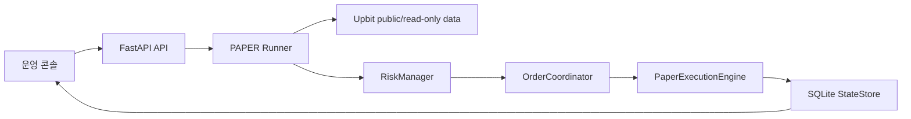

# Release 01 PAPER Runner Plan

## 목적

사용자가 기대한 `PAPER + 운영 콘솔` 자동매매 앱을 구현하기 전에, 남은 작업을 작고 검증 가능한 순서로 정리한다.

1차 목표는 실제 돈을 쓰는 `LIVE`가 아니다. 업비트 공개 시세를 읽고, 사용자가 설정한 가상 KRW 현금으로만 PAPER 주문, 체결, 포지션, 손익을 갱신하는 안전한 닫힌 루프를 만든다.

## 현재 확인 상태

| 항목 | 확인 결과 |
|---|---|
| 브랜치 | `codex/start-m0-contracts` |
| 최근 커밋 | `bffc138 Build paper MVP backend and scope docs` |
| 테스트 | `pytest` 기준 `92 passed, 1 warning` 확인 |
| 운영 콘솔/API | 최소 FastAPI 서버와 정적 콘솔이 있음 |
| PAPER 엔진 | `PaperExecutionEngine`, `PaperPortfolio`가 있음 |
| 주문 안전성 | `OrderCoordinator`, 주문 상태 전이, 중복 진입 차단이 있음 |
| 리스크 차단 | `RiskManager`가 킬스위치, 복구, 데이터 품질, 노출, 보호 없는 포지션을 차단함 |
| 시장 데이터 | 공개 마켓/티커 조회, 캔들 파싱/upsert, 데이터 품질 기초가 있음 |
| 아직 없는 것 | 자동 PAPER Runner, Runner 시작/중지/상태 API, 콘솔의 Runner 제어/가상 현금 설정 UI |

## 핵심 원칙

- `PAPER` 모드는 실제 주문 생성/취소 API를 절대 호출하지 않는다.
- 업비트 연동은 공개/public 조회 또는 읽기 전용 확인에만 사용한다.
- 주문 실행은 반드시 `PaperExecutionEngine`만 사용한다.
- `PAPER_ALLOW_REAL_ORDER_API=false`가 기본이며, 이 상태에서 실제 주문 API 호출은 0건이어야 한다.
- `LIVE_TRADING_ENABLED=false`를 유지한다.
- 돈, 가격, 수량, 수수료, PnL은 `Decimal` 또는 문자열 기반으로 다룬다.
- 신호 점수가 높아도 킬스위치, 복구 미완료, stale 데이터, 미확정 주문, 보호 없는 포지션 같은 hard block이 있으면 주문하지 않는다.

## 목표 흐름



## API와 UI 저장 흐름

### 가상 시작 현금 설정

1. 운영 콘솔에서 `paper_initial_cash_krw`를 입력한다.
2. 콘솔이 `PATCH /api/settings/paper`를 호출한다.
3. API는 안전한 PAPER 설정만 갱신한다.
4. `StateStore`에 `PaperPortfolio.initial_cash_krw`를 저장한다.
5. 사용자가 리셋을 누르면 `POST /api/paper/reset`이 현재 가상 현금을 시작 현금으로 되돌린다.

검증:

```powershell
pytest tests/test_api_server.py::test_patch_paper_settings_updates_safe_paper_values_only -v
pytest tests/test_api_server.py::test_paper_reset_api_resets_virtual_cash -v
```

### Runner 제어

추가할 최소 API:

```text
GET /api/paper-runner/status
POST /api/paper-runner/start
POST /api/paper-runner/stop
```

응답에 포함할 값:

| 필드 | 설명 |
|---|---|
| `running` | Runner 실행 여부 |
| `mode` | 항상 `PAPER` 또는 차단 상태 |
| `started_at` | 시작 시각 |
| `stopped_at` | 중지 시각 |
| `last_tick_at` | 마지막 루프 실행 시각 |
| `selected_markets` | 감시 대상 KRW 마켓 |
| `last_action` | 마지막 동작 |
| `last_block_reason` | 마지막 차단 사유 |
| `paper_cash_krw` | 가상 사용 가능 현금 |
| `paper_locked_cash_krw` | 가상 묶인 현금 |

## Runner 설계

초기 MVP Runner는 단순하고 안전한 구조로 만든다.

| 구성 | 방향 |
|---|---|
| 실행 방식 | FastAPI 프로세스 내부 백그라운드 스레드 또는 현재 프로젝트에 맞는 최소 async task |
| 반복 주기 | 짧은 고정 interval, 설정 가능하되 MVP에서는 보수적 기본값 |
| 시장 선택 | `UpbitRestClient.list_all_tickers(["KRW"])`와 `select_top_krw_alt_markets` 사용 |
| 가격 입력 | 공개 티커의 현재가 또는 테스트용 주입 데이터 |
| 주문 생성 | `OrderCoordinator.create_entry_order` |
| 가상 체결 | `PaperExecutionEngine.buy`, `reserve_buy_order`, `fill_buy_order` 중 MVP에 맞는 최소 경로 |
| 리스크 | 매 tick마다 `RiskManager.evaluate_new_entry` 선행 |
| 상태 저장 | 주문, 체결, 포지션, 손절 보호, 리스크 차단, 감사 이벤트 저장 |
| 중지 | stop event로 다음 tick 전에 안전 중지 |
| 중복 시작 | 이미 실행 중이면 새 Runner를 만들지 않고 현재 상태 반환 |

초기 자동매매 전략은 보수적으로 둔다.

- 기본은 관측과 안전 검증 우선이다.
- 진입 금액은 가상 현금의 작은 비율 또는 고정 최소 금액으로 제한한다.
- 미확정 주문이 있으면 같은 마켓 신규 진입을 만들지 않는다.
- 손실 포지션에는 물타기하지 않는다.
- 보호 없는 포지션이 있으면 신규 진입을 차단한다.

## 단계별 작업 순서

### 1단계: 상태와 설정 흐름 정리

작업:

- `PATCH /api/settings/paper`가 런타임 상태뿐 아니라 저장소의 `PaperPortfolio.initial_cash_krw`와 일관되도록 정리한다.
- 콘솔에서 현재 가상 현금, 잠긴 현금, 시작 현금을 볼 수 있게 API 응답을 보강한다.

검증:

```powershell
pytest tests/test_api_server.py::test_patch_paper_settings_updates_safe_paper_values_only -v
pytest tests/test_paper_trading.py::test_paper_portfolio_can_be_saved_loaded_and_reset -v
```

### 2단계: Runner 상태 모델 추가

작업:

- `src/haley/paper_runner.py`를 추가한다.
- `PaperRunnerState`와 `PaperRunner`를 정의한다.
- 시작, 중지, 상태 조회만 먼저 구현하고 주문은 아직 만들지 않는다.

검증:

```powershell
pytest tests/test_paper_runner.py -v
```

### 3단계: 공개 시세 조회 연결

작업:

- Runner가 업비트 공개 ticker 조회만 사용해 대상 마켓을 고른다.
- 인증 헤더 없이 public/read-only 요청만 나가는지 테스트한다.
- 주문 생성/취소 URL 또는 메서드는 만들지 않는다.

검증:

```powershell
pytest tests/test_upbit_client.py -v
pytest tests/test_market_data.py::test_select_top_krw_alt_markets_excludes_non_krw_and_majors_by_default -v
```

### 4단계: 리스크 차단 선행

작업:

- Runner tick 시작 시 `RiskManager.evaluate_new_entry`를 먼저 호출한다.
- 차단 사유가 있으면 주문 생성 없이 상태에 `last_block_reason`을 저장한다.
- 킬스위치 ON, stale 데이터, 보호 없는 포지션, 미확정 주문 상황을 테스트한다.

검증:

```powershell
pytest tests/test_risk_manager.py -v
pytest tests/test_paper_runner.py -v
```

### 5단계: PAPER 가상 주문과 체결 연결

작업:

- 리스크를 통과한 경우에만 `OrderCoordinator`로 주문 의도를 만든다.
- 실제 exchange 주문 API 대신 `PaperExecutionEngine`으로 가상 체결한다.
- 체결 후 포지션, 잔고, 수수료, 손절 감시 상태가 저장되는지 확인한다.

검증:

```powershell
pytest tests/test_order_coordinator.py -v
pytest tests/test_paper_trading.py -v
pytest tests/test_paper_runner.py -v
```

### 6단계: Runner API 추가

작업:

- `GET /api/paper-runner/status`
- `POST /api/paper-runner/start`
- `POST /api/paper-runner/stop`
- 상태 변경 API는 `request_id`, `idempotency_key`, `operator_id`, `reason`을 받는다.

검증:

```powershell
pytest tests/test_api_server.py -v
```

### 7단계: 실제 주문 API 호출 차단 테스트 강화

작업:

- fake exchange 또는 fake HTTP client로 실제 주문 생성/취소 호출이 발생하면 테스트가 실패하도록 만든다.
- Runner, PaperExecutionEngine, DRY_RUN API 모두에서 `would_call_real_order_api=false` 또는 호출 0건을 확인한다.

검증:

```powershell
pytest tests/test_paper_trading.py::test_paper_execution_engine_never_calls_real_order_api -v
pytest tests/test_api_server.py::test_dry_run_order_validates_request_without_creating_order -v
pytest tests/test_paper_runner.py -v
```

### 8단계: 운영 콘솔 확장

작업:

- Runner 실행 상태, 시작/중지 버튼을 추가한다.
- 가상 시작 현금 입력, 저장, 리셋 버튼을 추가한다.
- 가상 현금, 잠긴 현금, 주문, 포지션, 실현 PnL, 차단 사유를 한 화면에서 확인하게 한다.
- 화면은 운영 감시용 콘솔로 유지하고, 투자자용 매매 화면처럼 만들지 않는다.

검증:

```powershell
.\run.bat
```

브라우저에서 확인:

```text
http://127.0.0.1:8000/console
```

### 9단계: 전체 회귀 확인

검증:

```powershell
pytest
python -m compileall src tests
```

## MVP 제외 항목

아래 항목은 이번 Runner 작업에서 구현하지 않는다.

- 실제 `LIVE` 주문 생성/취소
- 소액 실거래
- 실거래 포지션 변경
- 실거래 위험 설정 화면
- 장시간 WebSocket 데몬 완성
- 자동 재연결과 REST 누락 캔들 보정 루프
- 실시간 차트 고도화
- 전략 파라미터 최적화
- 수익률 보장 또는 승률 보장
- 외부 뉴스, 김치프리미엄, 온체인 데이터 hard block

## 완료 기준

- 콘솔에서 가상 시작 현금을 설정할 수 있다.
- Runner를 콘솔/API에서 시작, 중지, 상태 조회할 수 있다.
- Runner가 업비트 public/read-only 데이터만 읽는다.
- Runner가 실제 주문 생성/취소 API를 호출하지 않는다.
- `PAPER`에서 가상 주문, 체결, 포지션, 수수료, PnL이 갱신된다.
- 차단 사유가 있으면 주문이 생성되지 않고 콘솔에 이유가 보인다.
- `pytest`와 `python -m compileall src tests`가 통과한다.
