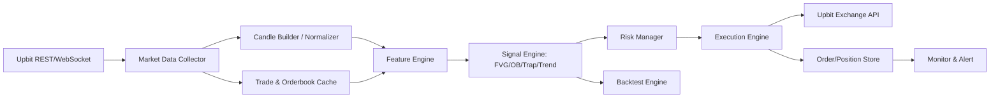
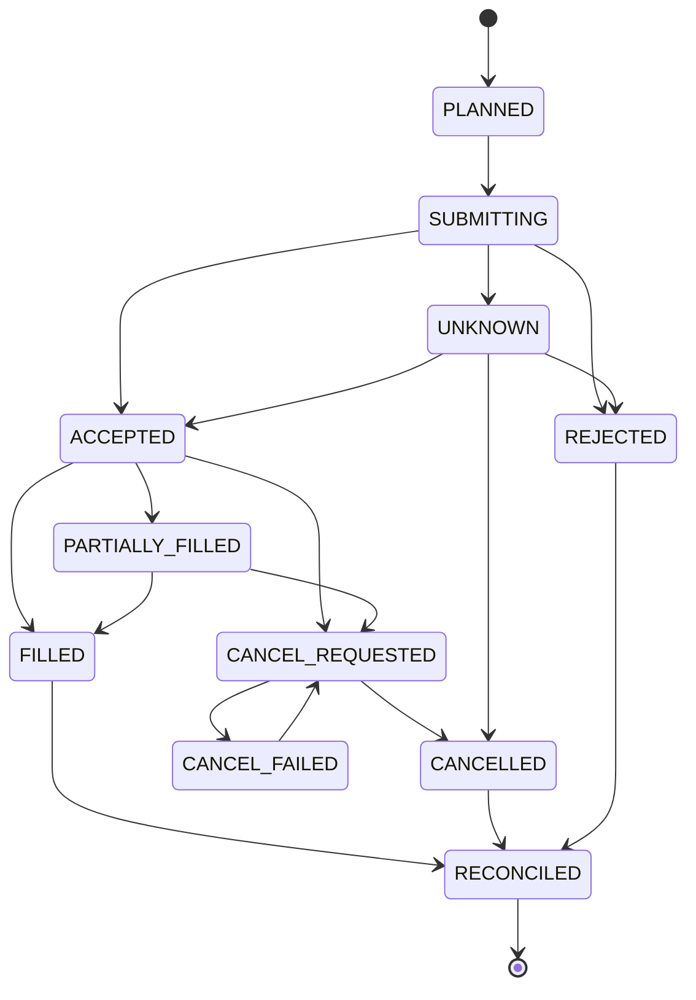

# 업비트 API와 실시간 거래 시스템 명세

작성일: 2026-05-26
분리 기준: upbit_auto_trading_strategy_spec.md의 관련 장을 목적별 문서로 분리


> 원본 문서에서 분리된 상세 문서입니다. 허브 문서: `../../upbit_auto_trading_strategy_spec.md`

## 5. 업비트 API 데이터 기준 구현 가능성

### 5.1 사용 가능한 데이터

공개 데이터:

- 마켓 목록
- 현재가/티커
- 체결 내역
- 호가/오더북
- 분봉, 일봉, 주봉, 월봉
- WebSocket 실시간 ticker/trade/orderbook/candle

개인 인증 데이터:

- 주문 가능 정보
- 주문 생성/취소
- 주문 조회
- 잔고 조회

자동매매에 필요한 최소 데이터:

- `1m`, `5m`, `15m` OHLCV
- 실시간 체결 stream
- 실시간 orderbook stream
- 계정 잔고
- 주문 가능 금액
- 미체결 주문

### 5.2 구현 불가능하거나 위험한 요소

- 세력/기관 의도 추정: 직접 구현 불가. 거래량 급증, 체결강도, 호가 불균형으로 대체.
- 숏 포지션: 업비트 현물 기준 일반 자동매매에서는 지원하지 않는 것으로 보고, 하락 신호는 매도/회피로 처리.
- "오더블럭만 보고 진입": 위험. 반드시 trap, FVG, 추세 필터, 리스크 조건과 결합.
- "기다리면 온다"식 진입: 자동매매에서는 기회비용과 조건 만료 시간을 둬야 한다.

### 5.3 업비트 데이터 정합성 규칙

업비트 실시간 데이터는 "항상 완성된 정규 캔들이 순서대로 온다"는 가정으로 처리하지 않는다.

- WebSocket candle 데이터는 같은 `candle_date_time`이 여러 번 올 수 있으므로 `market + timeframe + candle_date_time` 기준으로 upsert한다.
- 해당 구간에 체결이 없으면 캔들이 생성되지 않을 수 있다. 지표 연속성을 위해 내부 보정 캔들을 만들 수 있지만, 이 캔들은 `synthetic=true`로 표시한다.
- `synthetic=true` 캔들은 EMA/ATR 같은 연속 지표에는 사용할 수 있지만 FVG, OB, Trap, volume impulse 생성에는 사용하지 않는다.
- 실시간 캔들은 구간 종료 후 `candle_grace_ms`가 지난 뒤에만 확정 캔들로 사용한다.
- 1분봉/5분봉/15분봉 혼합 시 상위 타임프레임 캔들은 완전히 마감되기 전까지 신호 생성에 사용할 수 없다.
- WebSocket 데이터가 `stale_timeout_ms` 이상 갱신되지 않으면 해당 마켓 신규 진입을 금지하고 REST로 보정한다.
- WebSocket과 REST 보정 결과가 허용 오차 이상 다르면 해당 마켓은 `DATA_MISMATCH` 상태로 두고 신규 주문을 막는다.
- 로컬 시간은 NTP 등으로 동기화하고, 이벤트에는 `exchange_ts`, `received_ts`, `processed_seq`를 함께 저장한다.

### 5.4 업비트 주문/잔고/레이트 리밋 제약

실거래 주문은 전략 점수와 별개로 거래소 제약을 먼저 통과해야 한다.

- 시장가 매수는 `side=bid`, `ord_type=price`, `price=KRW 주문금액`, `volume` 제외로 요청한다.
- 시장가 매도는 `side=ask`, `ord_type=market`, `volume=매도수량`, `price` 제외로 요청한다.
- 지정가 주문 가격은 KRW 마켓 호가 단위에 맞게 보정하고, 총 주문금액은 최소 주문금액 이상이어야 한다.
- 주문 생성 전 주문 가능 정보와 잔고를 확인해 주문 가능 금액, locked 금액, 예상 수수료를 반영한다.
- private WebSocket 주문/자산 이벤트는 초기 스냅샷이 아니므로, 시작/재시작 시 REST 잔고와 미체결 주문 조회로 bootstrap한 뒤 private WebSocket을 붙인다.
- REST 요청은 그룹별 토큰 버킷으로 제한하고, 응답의 `Remaining-Req`를 기준으로 속도를 조절한다.
- 429 응답은 지수 백오프, 418 응답은 응답의 차단 시간 동안 거래 중단으로 처리한다.
- API 키는 자산 조회, 주문 조회, 주문하기에 필요한 최소 권한만 부여하고 출금 권한은 제외한다.
- API 키와 JWT, nonce, query hash, Secret은 로그에 남기지 않는다.
- `client_order_key`는 내부 중복 주문 방지에 사용하고, 업비트 주문 `identifier`는 실제 주문 제출마다 계정 전체에서 영구적으로 유일한 값으로 생성한다.
- 주문 요청을 보내기 전 `identifier`, `client_order_key`, 요청 원문 해시, 의도 수량/금액을 먼저 영속 저장한다.
- 주문 생성 응답을 받지 못한 경우에는 같은 `identifier`로 주문 생성을 재시도하지 않고, 새 `identifier`로도 즉시 재주문하지 않는다. 먼저 원래 `identifier`, 미체결/종료 주문, 잔고와 locked 금액 변화를 조회해 실제 주문 접수 여부를 확정한다.
- `UNKNOWN` 주문이 남아 있는 동안 같은 마켓의 신규 진입 주문은 금지한다.
- 실거래 전에는 먼저 `PAPER`에서 실제 업비트 실시간 데이터와 가상 KRW 잔고로 전략 매매 활동을 검증한다. 이후 거래소가 공식 테스트 주문 환경을 제공하는 경우 이를 사용하고, 그렇지 않으면 최소 권한 `DRY_RUN` 체크리스트와 소액 주문으로 주문 타입, 호가 단위, 최소 주문금액, 권한 오류를 검증한다.

### 5.5 Upbit-only 운영 모드

본 전략의 기본 구현 모드는 `UPBIT_ONLY`다. 이 모드에서는 업비트 공개/개인 API와 업비트 WebSocket으로 수신 가능한 데이터만 hard block 조건에 사용할 수 있다.

- 김치프리미엄, 해외 가격, 환율, 뉴스/공지 피드 등 외부 데이터는 `EXTERNAL_RISK_FILTER_ENABLED=true`일 때만 hard block으로 사용한다.
- `UPBIT_ONLY` 모드에서 외부 데이터가 없거나 `unknown`이면 신규 진입 차단 사유가 아니라 포지션 크기 축소 또는 경고 로그로만 처리한다.
- 사용자가 외부 데이터 필터를 켠 경우에는 데이터 소스, 갱신 주기, 실패 시 동작, 오탐/미탐 대응 규칙을 별도 설정으로 고정해야 한다.

외부 데이터 정책은 다음 3가지 모드 중 하나로 명시한다.

| 모드 | 외부 데이터 사용 | 외부 데이터 `unknown` 시 동작 | 목적 |
|---|---|---|---|
| `UPBIT_ONLY` | 사용하지 않거나 참고 로그만 남김 | 신규 진입 차단 사유가 아님. 필요 시 포지션 크기 축소 또는 경고만 수행 | 업비트 API만으로 재현 가능한 기본 모드 |
| `EXTERNAL_OPTIONAL` | 김치프리미엄/뉴스/환율을 보조 필터로 사용 | 신규 진입은 허용할 수 있으나 포지션 크기 축소, 점수 가산 제외, 경고 로그 기록 | 기회 손실을 줄이면서 외부 리스크를 참고 |
| `EXTERNAL_REQUIRED` | 외부 필터를 hard block 조건으로 사용 | 신규 진입 금지 | 외부 리스크 회피를 최우선으로 하는 보수 모드 |

## 7. 시스템 아키텍처



모듈:

- `MarketDataCollector`: WebSocket 연결, 재연결, heartbeat, REST 보정.
- `CandleStore`: 1m/5m/15m 캔들 저장.
- `FeatureEngine`: ATR, EMA, 피벗, FVG, OB, 채널, fake out 계산.
- `SignalEngine`: 셋업 점수화 및 진입/청산 신호 생성.
- `RiskManager`: 포지션 크기, 일 손실, 중복 진입 제한.
- `ExecutionEngine`: 주문 생성, 취소, 체결 확인, 부분 익절.
- `BacktestEngine`: 동일한 Feature/Signal 로직을 과거 캔들에 적용.
- `AuditLogger`: 모든 신호, 주문, 취소, 체결, 오류를 기록.

### 7.1 운영 우선순위

실시간 시스템은 다음 우선순위를 따른다.

```text
KillSwitch > Recovery > CircuitBreaker > Reconciliation > Risk > DataQuality > Signal > Execution
```

신호 점수는 주문 후보를 고르는 도구일 뿐이다. 위 우선순위에서 앞선 계층이 차단 상태이면 주문을 생성하지 않는다.

### 7.2 단일 진실 공급원

거래소 상태가 최종 진실이다. `StateStore`는 현재 상태 캐시와 복구 보조 자료이며, `AuditLog`는 변경 이력이다.

- 주문/체결/잔고의 최종 판정은 업비트 REST 조회와 체결 이벤트를 우선한다.
- 로컬 상태와 거래소 상태가 다르면 거래소 상태를 우선하고, 불일치는 감사 로그에 남긴다.
- Zone과 Signal은 시장 데이터에서 재계산 가능하지만, Order와 Position은 거래소 대조로 복구해야 한다.

### 7.3 실시간 주문/상태 저장 아키텍처

모든 신호, 주문 의도, API 요청, API 응답, 체결, 취소, 포지션 변경은 `StateStore`와 `AuditLog`에 기록한다.

필수 컴포넌트:

- `OrderCoordinator`: 신호를 주문 의도로 변환하고 중복 주문을 차단한다.
- `StateStore`: 주문, 체결, 포지션, 리스크 상태를 트랜잭션으로 영속 저장한다.
- `ExecutionEngine`: 업비트 주문 생성/취소/조회 API를 호출하는 어댑터 역할을 한다.
- `ReconciliationWorker`: 로컬 주문/포지션 상태와 거래소 상태를 주기적으로 대조한다.
- `RecoveryManager`: 재시작 시 거래소 조회 결과를 기준으로 로컬 상태를 복구한다.
- `CircuitBreaker`: API 장애, 데이터 지연, 잔고 불일치, 손실 한도 초과 시 신규 진입을 중단한다.
- `Monitor & Alert`: 운영 지표와 장애 이벤트를 수집하고 알림을 발송한다.

### 7.4 주문 중복 방지 규칙

모든 주문은 `client_order_key`를 가진다.

```text
client_order_key = hash(strategy_id, strategy_version, market, side, signal_candle_ts, setup_id)
```

동일한 `client_order_key`에 대해 `PLANNED`, `SUBMITTING`, `ACCEPTED`, `PARTIALLY_FILLED`, `UNKNOWN` 상태 주문이 존재하면 신규 주문을 생성하지 않는다. `UNKNOWN`, `SUBMITTING`, `PARTIALLY_FILLED` 주문이 있는 마켓은 거래소 조회로 상태가 확정될 때까지 신규 진입을 금지한다.

`client_order_key`는 전략 내부의 논리적 신호 중복 방지 키이며, 업비트 주문 요청의 `identifier`와 동일하게 취급하지 않는다. 업비트 `identifier`는 실제 주문 제출 시마다 계정 전체에서 영구적으로 유일한 값으로 생성한다. 주문 제출 전에는 생성된 `identifier`를 `OrderState.exchange_identifier`에 먼저 기록하고, 주문 생성 요청 원문과 함께 `SUBMITTING` 상태로 저장한다.

단, 주문 생성 응답을 받지 못했다는 이유만으로 새 `identifier`를 발급해 즉시 재주문하지 않는다. 새 주문은 원래 `identifier` 기준 조회, 미체결/종료 주문 조회, 잔고 및 locked 금액 대조를 통해 기존 주문이 없다는 사실이 확정된 뒤에만 생성할 수 있다. 이 확정이 끝나기 전까지 해당 주문은 `UNKNOWN` 상태이며, 같은 마켓 신규 진입은 차단된다.

### 7.5 주문 상태 머신



상태 전이는 반드시 `ExecutionEvent`로 기록한다. 상태 전이 없이 포지션 수량을 직접 변경하지 않는다.

### 7.6 장애 복구 시나리오

API 장애:

- 429, 5xx, timeout 발생 시 지수 백오프를 적용한다.
- 주문 생성 응답을 받지 못하면 주문 상태를 `UNKNOWN`으로 저장한다.
- `UNKNOWN` 상태가 존재하는 동안 같은 마켓 신규 주문은 금지한다.
- 거래소 주문 조회로 실제 주문 존재 여부를 확인한 뒤 상태를 확정한다.

네트워크/WebSocket 단절:

- WebSocket 단절 시 REST 보정으로 최근 캔들/체결을 복구한다.
- 데이터 stale 임계치를 넘으면 신규 진입을 중단한다.
- 이미 열린 포지션은 손절/청산 관리만 유지한다.
- 복구 시도 후 불일치가 남으면 `RECOVERY_ONLY` 모드로 유지한다.

부분 체결:

- 부분 체결 발생 시 체결 수량만큼 포지션을 생성한다.
- 남은 미체결 수량은 `entry_timeout_sec` 초과 시 취소 요청한다.
- 취소 성공 시 체결분 기준으로 손절/익절 주문을 재계산한다.

주문 취소 실패:

- 취소 실패 시 즉시 주문 조회를 수행한다.
- 주문이 이미 체결되었으면 포지션으로 반영한다.
- 주문이 여전히 열려 있으면 최대 `cancel_retry_max`회 재시도한다.
- 재시도 실패 시 `CANCEL_FAILED`로 전환하고 신규 진입을 중단한다.

재시작 복구:

1. 신규 주문을 금지하고 `RECOVERY_ONLY` 모드로 시작한다.
2. 로컬 `StateStore`에서 미완료 주문과 열린 포지션을 조회한다.
3. 업비트 미체결 주문, 주문 상세, 잔고, 최근 체결을 조회한다.
4. 로컬 상태와 거래소 상태가 다르면 거래소 상태를 우선한다.
5. 불일치 내역은 `reconciliation_mismatch` 감사 로그로 남긴다.
6. 복구 완료 전까지 신규 주문을 생성하지 않는다.

### 7.7 운영 모드

- `BACKTEST`: 과거 데이터 검증.
- `PAPER`: 실제 업비트 실시간 데이터 기반 모의 매매. 사용자가 설정한 가상 KRW 현금으로 가상 주문, 체결, 미체결, 부분 체결, 포지션, 손절/익절, PnL을 갱신한다. 실제 주문 API는 호출하지 않는다.
- `DRY_RUN`: 주문 직전까지 실행하되 실제 주문 API는 호출하지 않음. 주문 요청 원문, 호가 단위, 최소 주문금액, 권한 오류, 차단 사유를 검증한다.
- `LIVE`: 실거래 모드.
- `RECOVERY_ONLY`: 복구/대조만 수행하고 신규 주문 금지.
- `KILL_SWITCHED`: 모든 신규 주문 금지, 열린 주문 정리와 알림만 수행.

## 8. 구현 명세

### 8.1 데이터 구조

주문, 잔고, 체결, 수수료, 실현/미실현 손익처럼 실제 돈과 수량에 연결되는 값은 `float`를 사용하지 않는다. 부동소수점 오차가 호가 단위, 최소 주문금액, 잔고 부족 오류로 이어질 수 있기 때문이다. 지표 계산 내부에서는 `float`를 사용할 수 있지만, 주문 직전에는 반드시 `Decimal` 또는 정수 최소 단위로 변환하고 거래소 호가 단위에 맞게 보정한다.

```python
from decimal import Decimal

Money = Decimal
Price = Decimal
Quantity = Decimal
Ratio = Decimal

class Candle:
    market: str
    timeframe: str
    ts: int
    open: Price
    high: Price
    low: Price
    close: Price
    volume: Quantity
    value: Money

class Zone:
    market: str
    kind: str  # fvg, ob, support, resistance
    direction: str  # bullish, bearish
    low: Price
    high: Price
    state: str
    boundary_mode: str
    source_candle_ids: list[str]
    created_ts: int
    confirmed_ts: int
    last_touched_ts: int | None
    touch_count: int
    fill_ratio: Ratio
    mitigation_count: int
    invalidated_ts: int | None
    invalidated_reason: str | None
    expires_ts: int
    score: int
    mitigated: bool

class Signal:
    market: str
    side: str  # buy, sell
    reason: list[str]
    entry: Price
    stop: Price
    targets: list[Price]
    confidence: Ratio
    invalidation: list[str]
```

### 8.1.1 운영 데이터 구조

```python
class TradePlan:
    trade_plan_id: str
    signal_id: str
    market: str
    side: str
    entry_rule: str
    stop_price: Price
    targets: list[Price]
    status: str
    created_ts: int

class OrderIntent:
    client_order_key: str
    trade_plan_id: str
    market: str
    side: str
    order_type: str
    price: Price | None
    volume: Quantity
    status: str
    created_ts: int

class OrderState:
    client_order_key: str
    exchange_order_id: str | None
    exchange_identifier: str | None
    market: str
    side: str
    status: str
    requested_volume: Quantity
    filled_volume: Quantity
    remaining_volume: Quantity
    avg_fill_price: Price | None
    last_error: str | None
    updated_ts: int

class Fill:
    exchange_order_id: str
    market: str
    side: str
    price: Price
    volume: Quantity
    fee: Money
    ts: int

class PositionState:
    market: str
    status: str
    volume: Quantity
    avg_entry_price: Price
    stop_price: Price
    realized_pnl: Money
    unrealized_pnl: Money
    updated_ts: int

class ExecutionEvent:
    event_id: str
    event_ts: int
    exchange_ts: int | None
    received_ts: int
    processed_seq: int
    event_type: str
    before_state: str | None
    after_state: str | None
    raw_request: dict | None
    raw_response: dict | None
```

API 요청 직전에는 `Price`, `Quantity`, `Money`를 문자열 숫자로 직렬화한다. 로그에는 원문 요청을 남기되 API 키, JWT, nonce, query hash, Secret은 절대 저장하지 않는다.

### 8.2 파라미터 기본값

| 파라미터 | 기본값 |
|---|---:|
| `timeframe_entry` | 5m |
| `timeframe_filter` | 15m |
| `atr_period` | 14 |
| `pivot_left` / `pivot_right` | 2 / 2 |
| `min_gap_pct` | 0.0015 |
| `min_gap_atr` | 0.25 |
| `impulse_atr_mult` | 1.2 |
| `volume_mult` | 1.3 |
| `break_threshold` | 0.0008 |
| `reclaim_window` | 3 |
| `wick_ratio_min` | 0.45 |
| `risk_per_trade` | 0.5% |
| `max_daily_loss` | 2% |
| `max_spread_pct` | 0.20% |
| `min_daily_value` | 백테스트에서 분위수로 결정 |
| `lookback_ob` | 20 candles |
| `displacement_window` | 5 candles |
| `channel_window` | 80 candles |
| `candle_grace_ms` | 1500 |
| `stale_timeout_ms` | 5000 |
| `min_stop_pct` | 0.20% |
| `max_stop_pct` | 2.00% |
| `max_hold_candles_without_progress` | 12 |
| `cancel_retry_max` | 3 |
| `signal_score_threshold` | 70, 단 실거래 확정값이 아니라 초기 가설/페이퍼 전용 |
| `max_intraday_drawdown` | 3% |
| `max_total_crypto_exposure` | 60% |
| `max_correlated_exposure` | 35% |
| `max_kimchi_premium_abs` | 5% |
| `kimchi_premium_change_limit` | 2% / 30m |
| `max_expected_slippage_pct` | 0.15% |
| `flash_move_pct` | 3% / 1m |
| `cooldown_minutes` | 30 |
| `news_risk_cooldown_minutes` | 360 |
| `entry_timeout_sec` | 20 |
| `watchdog_heartbeat_sec` | 5 |
| `max_unprotected_position_sec` | 10 |
| `external_risk_mode` | UPBIT_ONLY |
| `paper_initial_cash_krw` | 사용자 설정 |
| `paper_virtual_trading_enabled` | true |
| `paper_allow_real_order_api` | false |
| `top_alt_count` | 10 |
| `include_major_markets` | false |

### 8.3 신호 점수화

점수화는 진입 후보를 정렬하고 사람이 이유를 이해하기 쉽게 만드는 설명용 도구다. 실거래 진입 여부는 hard block, 데이터 품질, 손익비, 유동성, 주문 가능성, 검증된 패턴 기대값이 먼저 결정한다. 아래 점수와 `signal_score_threshold`는 초기 가설이며, 워크포워드와 페이퍼 트레이딩 검증 전에는 실거래 확정 기준으로 사용하지 않는다.

```text
base_score = 0
+20 bullish FVG valid
+20 bullish OB valid
+20 FVG and OB overlap
+15 fake out reclaim
+10 trend filter pass
+10 volume impulse
+5 orderbook imbalance  # 호가 로그 검증 전에는 참고 필터로만 사용
-20 spread too wide
-30 bearish FVG above price
-30 upper fake out detected
-50 kimchi premium/news risk blocked
-80 market_event.warning or caution true
-100 daily loss limit hit
```

진입 기준:

```text
hard_block_pass == true
data_quality_pass == true
validated_pattern_expectancy_pass == true
risk_reward >= 1.5
no_open_position_same_market
daily_loss_limit_not_hit
market_event_safe == true
external_risk_filter_pass_or_disabled == true
expected_slippage <= max_expected_slippage_pct
```

점수화는 hard block을 대체하지 않는다. 유의종목, 데이터 불일치, 일 손실 제한, 레이트 리밋 차단, 잔고 동기화 실패, recovery-only 모드에서는 `score`와 무관하게 진입 금지다.

각 점수 항목은 다음 검증 근거를 가져야 한다.

- `evidence_name`: 어떤 패턴 또는 필터인지.
- `sample_count`: 검증 거래 수. 실거래 후보는 원칙적으로 200건 이상.
- `net_expectancy`: 수수료와 슬리피지를 차감한 기대값.
- `confidence_interval`: 부트스트랩 등으로 계산한 신뢰구간.
- `validation_window`: 학습/검증/테스트 구간.

### 8.4 감사 로그와 모니터링

감사 로그는 append-only로 저장하며 다음 필드를 포함한다.

- `event_id`, `event_ts`, `strategy_version`, `market`, `signal_id`.
- `client_order_key`, `exchange_order_id`.
- `event_type`: signal, risk_check, order_submit, order_ack, fill, cancel, error, recovery, reconciliation.
- API 요청 파라미터, 응답 원문, 오류 코드, 재시도 횟수.
- 상태 전이 전/후 값.
- 주문하지 않은 신호의 탈락 사유.

필수 모니터링 지표:

- WebSocket reconnect count.
- last trade/orderbook/candle age seconds.
- REST API success/error/timeout rate.
- order submit latency, order ack latency.
- partial fill count, cancel failure count, unknown order count.
- local/exchange position mismatch count.
- daily realized PnL, max drawdown.
- circuit breaker status.

