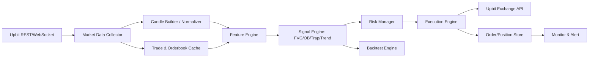
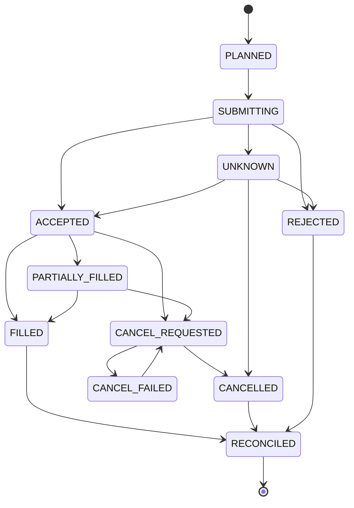

# 업비트 실시간 자동매매 전략 명세서

작성일: 2026-05-26  
대상 이미지: `step-01.png` ~ `step-05.png`  
목표: 이미지에 포함된 코인 매매 개념을 업비트 API에서 제공하는 실시간 데이터만으로 구현 가능한 자동매매 알고리즘으로 재설계한다.

> 주의: 이 문서는 투자 수익, 원금 보전, 특정 승률을 보장하지 않는다. 이미지의 SMC/ICT 계열 개념은 상당 부분 재량적 해석을 포함하므로, 자동매매에는 수치화 가능한 규칙, 손실 제한, 거래 중단 조건, 검증 절차를 반드시 붙인다. 실제 매매 전에는 손실 가능 금액 안에서만 테스트해야 하며, 본 문서는 투자 권유가 아니라 구현 가능성 검토 자료다.

## 1. 이미지별 내용 정리

### 1.1 `step-01.png` - 오더블럭(Order Block)

핵심 주장:

- 오더블럭은 강한 가격 변동 직전에 형성된 특정 가격 범위다.
- 스마트 머니 또는 큰 주문의 흔적으로 해석한다.
- 상승형 오더블럭은 강한 상승 전 마지막 하락 캔들 구간, 하락형 오더블럭은 강한 하락 전 마지막 상승 캔들 구간으로 설명된다.
- 형성 원리는 유동성 확보, 스탑 헌팅, 반대 매매 유도, 이후 본래 방향 재개로 설명된다.
- 진입은 유동성 sweep, 구조 형성, 갭(FVG), 오더블럭 재방문을 함께 볼수록 신뢰도가 높다고 설명한다.
- 손절은 오더블럭을 만든 캔들의 꼬리 고점/저점 또는 몸통 기준으로 제시한다.
- 익절은 고점/저점 돌파, 구조 돌파, 반대 오더블럭, 반대 구조 출현으로 제시한다.

자동화 관점:

- "스마트 머니" 자체는 업비트 데이터로 직접 관측 불가능하다.
- 하지만 "마지막 반대색 캔들 + 강한 변동 + 구조 돌파 + 재방문"은 OHLCV로 수치화 가능하다.
- 업비트 현물 기준 하락형 오더블럭은 숏 진입이 아니라 보유 자산 청산, 신규 매수 금지, 리스크 축소 신호로만 사용한다.

### 1.2 `step-02.png` - FVG(Fair Value Gap)

핵심 주장:

- FVG는 3개 캔들 구조에서 급격한 이동으로 남은 불균형 구간이다.
- 상승형 FVG는 1번 캔들 고가와 3번 캔들 저가 사이 빈 공간, 하락형 FVG는 1번 캔들 저가와 3번 캔들 고가 사이 빈 공간으로 설명된다.
- FVG는 가격이 되돌아와 채우려는 성향이 있으며, 오더블럭과 함께 쓰면 좋은 진입 근거라고 설명한다.
- 진입은 FVG 재방문, 유동성 sweep, 오더블럭과 겹침, 충분한 갭 크기 조건을 함께 사용하라고 제시한다.
- 손절은 FVG 형성 캔들의 꼬리, 저점/고점, 리스크 허용범위 기준으로 제시한다.
- 익절은 FVG를 만든 파동의 고점/저점, 구조 돌파, 반대 FVG 또는 반대 구조 출현으로 제시한다.

자동화 관점:

- FVG는 3캔들 규칙으로 가장 명확하게 자동화 가능하다.
- 다만 업비트는 연속 거래 시장이므로 주식의 실제 공백 갭과 다르게, 캔들 집계 단위에서 생기는 "범위 미거래"로 해석해야 한다.
- 갭 크기가 너무 작으면 수수료/슬리피지에 묻히므로 ATR 또는 가격 대비 최소 폭 필터가 필요하다.

### 1.3 `step-03.png` - 추세선(Trend Line)

핵심 주장:

- 추세선은 시장 방향성을 시각화하는 도구다.
- 상승 추세선은 의미 있는 저점들을 연결하고, 하락 추세선은 의미 있는 고점들을 연결한다.
- 추세선은 가격을 움직이는 원인이 아니라 시장 참여자의 심리와 유동성이 모이는 구간으로 설명된다.
- 진입 전략은 추세선 반등(Bounce)과 추세선 이탈 후 리테스트(Breakout & Retest)로 나뉜다.
- Q&A에서는 몸통이 아니라 꼬리(wick)를 기준으로 선을 긋는다고 설명한다.

자동화 관점:

- 임의로 선을 긋는 방식은 구현 불가에 가깝다.
- 자동매매에서는 피벗 고점/저점 기반 선형 회귀, RANSAC, 또는 최근 N개 피벗 연결 규칙으로 고정해야 한다.
- "각도"와 "터치 횟수"는 ATR 대비 거리 오차와 최소 피벗 수로 수치화한다.

### 1.4 `step-04.png` - 채널(Channel)

핵심 주장:

- 채널은 두 추세선을 평행하게 배치한 가격 변동 범위다.
- 상승 채널, 하락 채널, 횡보 채널, 확장 채널이 제시된다.
- 채널 상단은 저항, 하단은 지지로 사용한다.
- 전략은 채널 하단 매수/상단 익절, 채널 이탈 후 리테스트 진입, 과도한 이탈 후 복귀, 함정 패턴 회피 등이다.

자동화 관점:

- 회귀 채널로 구현 가능하다.
- 수동 평행선 대신 최근 N개 캔들의 선형 회귀 중심선과 표준편차/ATR 폭을 사용하면 안정적이다.
- 채널 매매는 추세 구간과 횡보 구간을 구분하지 않으면 잦은 손절이 발생할 수 있다.

### 1.5 `step-05.png` - Fake out과 함정(Trap)

핵심 주장:

- Fake out은 지지/저항/추세선/채널 등을 일시 돌파한 뒤 원래 범위로 복귀하는 움직임이다.
- Trap은 돌파를 믿고 진입한 참여자들이 반대 방향 움직임에 갇히는 구조다.
- 유동성 sweep, 지지/저항 레벨, 차트 패턴, 이동평균선 등을 함께 보라고 설명한다.
- 진입은 돌파 실패 후 재진입, 리테스트 실패, 원래 구간 복귀를 기준으로 제시된다.
- 손절은 fake out 저점/고점 바깥, 익절은 반대 유동성 구간 또는 1R/2R로 제시된다.

자동화 관점:

- 가장 구현 가치가 높은 부분이다.
- "이전 피벗 고점/저점 돌파 후 N캔들 내 종가 복귀"로 정의할 수 있다.
- 현물 기준으로 하락 fake out은 롱 진입 후보가 될 수 있고, 상승 fake out은 보유 물량 청산 또는 매수 금지 신호가 된다.

## 2. 이미지에서 추출한 매매 개념/전략 목록

| 개념 | 자동화 가능성 | 업비트 데이터 | 사용 방식 |
|---|---:|---|---|
| 오더블럭 | 중간 | OHLCV, 거래량, 체결 | 진입 후보 구역 |
| FVG | 높음 | OHLCV | 불균형 구간 및 되돌림 구역 |
| 추세선 | 중간 | OHLCV | 방향 필터, 반등/이탈 조건 |
| 채널 | 높음 | OHLCV | 평균 회귀/돌파 필터 |
| Fake out / Trap | 높음 | OHLCV, 체결, 호가 | 핵심 진입 트리거 |
| 유동성 Sweep | 중간 | OHLCV, 체결, 호가 | 이전 고점/저점 돌파 후 복귀 |
| 스탑 헌팅 | 낮음 | 직접 관측 불가 | 유동성 sweep으로 대체 |
| 스마트 머니 매집/분산 | 낮음 | 직접 관측 불가 | 거래량/체결강도/호가 불균형으로 대체 |
| 구조 돌파(BOS) | 높음 | OHLCV | 피벗 고점/저점 돌파 |
| 리테스트 | 높음 | OHLCV | 돌파 레벨 재접근 후 반응 |

## 3. 각 전략의 논리 구조 분석

### 3.1 오더블럭 논리

이미지 논리:

1. 큰손이 반대 방향으로 가격을 흔들어 유동성을 만든다.
2. 마지막 반대색 캔들 구간에 큰 주문 흔적이 남는다.
3. 이후 강한 변동과 구조 돌파가 발생한다.
4. 가격이 해당 구간으로 되돌아오면 재진입 기회가 된다.

자동화 규칙:

- 상승형 OB 후보:
  - 최근 `lookback_ob` 캔들 안에서 마지막 음봉을 찾는다.
  - 그 다음 `displacement_window` 캔들 안에 다음 조건이 발생해야 한다.
  - 종가가 최근 피벗 고점을 돌파한다.
  - 상승 캔들 몸통 크기가 `ATR * impulse_atr_mult` 이상이다.
  - 거래량이 `volume_sma * volume_mult` 이상이다.
  - 같은 구간에 상승형 FVG가 있으면 신뢰도 가산.
- 하락형 OB 후보:
  - 현물 자동매매에서는 신규 숏 진입이 아니라 청산/회피 구간으로 사용한다.

취약점:

- "기관 주문"은 직접 확인할 수 없다.
- OB는 사후적으로 잘 보이는 경우가 많아 과최적화 위험이 높다.

### 3.2 FVG 논리

자동화 규칙:

- 상승형 FVG:
  - `low[i] > high[i-2]`
  - 구간: `[high[i-2], low[i]]`
  - 중간 캔들 몸통 또는 전체 range가 `ATR * impulse_atr_mult` 이상이면 유효.
- 하락형 FVG:
  - `high[i] < low[i-2]`
  - 구간: `[high[i], low[i-2]]`
- 최소 폭:
  - `(zone_high - zone_low) / close[i] >= min_gap_pct`
  - 또는 `zone_width >= ATR * min_gap_atr`

거래 사용:

- 상승형 FVG가 상승 OB와 겹치고, 가격이 FVG 50% 이상 되돌림 후 반등하면 롱 후보.
- 하락형 FVG는 보유 포지션 청산 또는 신규 매수 금지 필터.

### 3.3 추세선 논리

자동화 규칙:

- 피벗 저점: `low[i]`가 좌우 `pivot_left/right`개 캔들의 저점보다 낮다.
- 피벗 고점: `high[i]`가 좌우 `pivot_left/right`개 캔들의 고점보다 높다.
- 상승 추세선:
  - 최근 피벗 저점 2~5개를 연결하거나 회귀한다.
  - 기울기 `slope > min_slope`.
  - 터치 횟수 `touch_count >= 2`.
  - 각 터치의 거리 `abs(low - line_price) <= ATR * line_tolerance_atr`.
- 하락 추세선:
  - 현물 기준으로 매수 금지/청산 필터에 우선 사용한다.

거래 사용:

- 추세선 반등은 단독 진입 금지.
- FVG/OB/Trap 중 최소 1개 이상과 결합해야 한다.

### 3.4 채널 논리

자동화 규칙:

- 최근 `channel_window`개 종가에 대해 선형 회귀 중심선을 계산한다.
- 채널 폭은 잔차 표준편차 `k * stdev` 또는 `ATR * channel_atr_mult`로 둔다.
- 상단/하단 접촉은 `distance_to_band <= ATR * tolerance`.
- 채널 유형:
  - 상승 채널: 회귀 기울기 양수.
  - 하락 채널: 회귀 기울기 음수.
  - 횡보 채널: 기울기 절댓값 작고 ADX 또는 추세강도 낮음.

거래 사용:

- 상승 채널 하단 + bullish trap + 상승 FVG/OB 겹침: 롱 후보.
- 채널 상단 접근 + 상승 fake out: 익절 또는 비중 축소.
- 하락 채널 안에서는 신규 롱 진입을 제한한다.

### 3.5 Fake out / Trap 논리

자동화 규칙:

- 하방 fake out, 롱 후보:
  - 최근 피벗 저점 또는 지지 레벨 아래로 `break_threshold` 이상 이탈.
  - `reclaim_window` 캔들 안에 종가가 다시 레벨 위로 복귀.
  - 복귀 캔들의 거래량이 평균 이상.
  - 아래꼬리 비율이 `lower_wick / range >= wick_ratio_min`.
  - 선택적으로 호가 불균형이 매수 우위로 전환.
- 상방 fake out, 청산/회피 후보:
  - 최근 피벗 고점 또는 저항 레벨 위로 돌파.
  - `reclaim_window` 캔들 안에 종가가 다시 레벨 아래로 복귀.
  - 위꼬리 비율이 기준 이상.

### 3.6 공통 Zone 상태 모델

OB, FVG, 지지/저항, 채널 밴드, 추세선 레벨은 모두 `Zone`으로 통합 관리한다. 단순히 "유효/무효"만 저장하지 않고, 생성 이후 수명주기를 상태로 관리한다.

```text
created -> active -> touched -> partially_filled -> mitigated -> filled
                                      \-> invalidated
                                      \-> expired
```

상태 정의:

- `created`: 확정 캔들 기준으로 구역이 처음 생성된 상태.
- `active`: 아직 진입 근거로 사용할 수 있는 상태.
- `touched`: 가격이 구역에 1회 이상 닿은 상태.
- `partially_filled`: FVG/OB 구역 일부가 채워진 상태.
- `mitigated`: FVG 50% 이상 또는 OB 중심값 이상 되돌림이 발생한 상태.
- `filled`: FVG가 완전히 채워졌거나 OB 구역을 완전히 관통한 상태.
- `invalidated`: 종가가 구역 반대편으로 확정 이탈한 상태.
- `expired`: 생성 후 `zone_max_age_candles`를 초과한 상태.

진입 후보는 `active`, `touched`, 첫 번째 `mitigated` 상태까지만 허용한다. `filled`, `invalidated`, `expired` 상태는 점수 가산에도 사용하지 않는다.

Zone 경계 계산은 전략 파라미터로 고정한다.

```text
zone_boundary_mode = wick | body | hybrid
```

- `wick`: 꼬리 전체를 포함해 넓게 잡는다.
- `body`: 몸통 기준으로 좁게 잡는다.
- `hybrid`: 진입 구역은 몸통, 무효화/손절은 꼬리 기준으로 둔다.

FVG는 "채워지면 진입"이 아니라 "채워지는 상태를 관찰한 뒤 반응을 확인"하는 구조로 쓴다. `touch`, `50% fill`, `full fill`, `close-through fill`을 구분하고, 완전 채움 이후에는 같은 FVG를 신규 진입 근거로 재사용하지 않는다.

Fake out / Trap은 레벨을 분리한다.

- `sweep_level`: 가격이 일시적으로 이탈한 기준 레벨.
- `reclaim_level`: 종가가 복귀해야 하는 기준 레벨.
- `entry_trigger_level`: 실제 진입을 허용하는 확인 레벨.
- `invalidation_level`: 진입 아이디어가 무효화되는 레벨.

Trap 확정은 기준 레벨 이탈, `reclaim_window` 안의 종가 복귀, 반대 방향 `min_follow_through_atr` 이상 진행 또는 반응 캔들/거래량/호가 조건 중 최소 2개 확인을 요구한다.

## 4. Bright Data MCP 조사 및 팩트 체크

Bright Data MCP는 로컬 래퍼 `C:\Users\buche\.codex\brightdata-mcp.cmd`로 실행해 `search_engine` 도구를 호출했다. 확인된 MCP 상태:

- `INITIALIZE_OK=true`
- `TOOLS_COUNT=17`
- `search_engine` 실제 호출 성공

조사 쿼리:

- `Upbit API websocket candle trade orderbook official documentation`
- `Upbit API rate limits quotation exchange official documentation`
- `Upbit API create order minimum order amount official documentation`
- `fair value gap order block trading strategy empirical evidence technical analysis`

확인된 공식/보조 자료:

- Upbit Developer Center: https://global-docs.upbit.com/
- Upbit API overview: https://global-docs.upbit.com/reference/api-overview
- Upbit Developer Center guide: https://global-docs.upbit.com/docs/developer-center-overview
- Upbit KR documentation: https://docs.upbit.com/kr
- Upbit official client examples: https://github.com/upbit-exchange/client
- FVG 개념 설명 예시: https://trendspider.com/learning-center/fair-value-gap-trading-strategy/

팩트 체크 결과:

| 항목 | 판단 | 근거/비고 |
|---|---|---|
| 업비트에서 실시간 체결/호가/티커 수신 가능 | 가능 | 공식 WebSocket은 ticker, trade, orderbook 등 실시간 스트림을 제공한다. |
| 업비트에서 캔들 데이터 조회 가능 | 가능 | 공식 Quotation REST API에서 분/일/주/월 캔들 조회를 제공한다. |
| 업비트 WebSocket 캔들 사용 가능 | 가능 | 공식 문서에 WebSocket candle reference가 존재한다. 단, 구현 시 실제 응답 필드와 갱신 주기 테스트 필요. |
| 주문/잔고 자동화 가능 | 가능 | Exchange API는 주문, 주문 조회, 잔고 조회를 제공하며 인증이 필요하다. |
| 오더블럭으로 기관 주문을 확정 가능 | 불가능 | 업비트 공개 데이터만으로 특정 기관/세력 주문을 식별할 수 없다. |
| FVG를 3캔들 가격 불균형으로 검출 | 가능 | OHLCV만으로 계산 가능하다. |
| 추세선/채널을 수동 방식 그대로 구현 | 부적합 | 수동 작도는 주관적이다. 피벗/회귀 기반 규칙으로 바꿔야 한다. |
| Fake out/Trap 자동 검출 | 가능 | 이전 고점/저점 돌파 후 종가 복귀, 꼬리 비율, 거래량 조건으로 수치화 가능하다. |
| 이미지 전략이 장기적으로 수익 보장 | 불가 | 공개 기술적 분석 패턴은 시장/기간/비용에 따라 성과가 크게 달라진다. 반드시 백테스트와 실거래 전 모의 검증 필요. |

## 5. 업비트 API 데이터 기준 구현 가능성

### 5.1 사용 가능한 데이터

공개 데이터:

- 마켓 목록
- 현재가/티커
- 체결 내역
- 호가/오더북
- 분봉, 일봉, 주봉, 월봉
- WebSocket 실시간 ticker/trade/orderbook/candle

개인 인증 데이터:

- 주문 가능 정보
- 주문 생성/취소
- 주문 조회
- 잔고 조회

자동매매에 필요한 최소 데이터:

- `1m`, `5m`, `15m` OHLCV
- 실시간 체결 stream
- 실시간 orderbook stream
- 계정 잔고
- 주문 가능 금액
- 미체결 주문

### 5.2 구현 불가능하거나 위험한 요소

- 세력/기관 의도 추정: 직접 구현 불가. 거래량 급증, 체결강도, 호가 불균형으로 대체.
- 숏 포지션: 업비트 현물 기준 일반 자동매매에서는 지원하지 않는 것으로 보고, 하락 신호는 매도/회피로 처리.
- "오더블럭만 보고 진입": 위험. 반드시 trap, FVG, 추세 필터, 리스크 조건과 결합.
- "기다리면 온다"식 진입: 자동매매에서는 기회비용과 조건 만료 시간을 둬야 한다.

### 5.3 업비트 데이터 정합성 규칙

업비트 실시간 데이터는 "항상 완성된 정규 캔들이 순서대로 온다"는 가정으로 처리하지 않는다.

- WebSocket candle 데이터는 같은 `candle_date_time`이 여러 번 올 수 있으므로 `market + timeframe + candle_date_time` 기준으로 upsert한다.
- 해당 구간에 체결이 없으면 캔들이 생성되지 않을 수 있다. 지표 연속성을 위해 내부 보정 캔들을 만들 수 있지만, 이 캔들은 `synthetic=true`로 표시한다.
- `synthetic=true` 캔들은 EMA/ATR 같은 연속 지표에는 사용할 수 있지만 FVG, OB, Trap, volume impulse 생성에는 사용하지 않는다.
- 실시간 캔들은 구간 종료 후 `candle_grace_ms`가 지난 뒤에만 확정 캔들로 사용한다.
- 1분봉/5분봉/15분봉 혼합 시 상위 타임프레임 캔들은 완전히 마감되기 전까지 신호 생성에 사용할 수 없다.
- WebSocket 데이터가 `stale_timeout_ms` 이상 갱신되지 않으면 해당 마켓 신규 진입을 금지하고 REST로 보정한다.
- WebSocket과 REST 보정 결과가 허용 오차 이상 다르면 해당 마켓은 `DATA_MISMATCH` 상태로 두고 신규 주문을 막는다.
- 로컬 시간은 NTP 등으로 동기화하고, 이벤트에는 `exchange_ts`, `received_ts`, `processed_seq`를 함께 저장한다.

### 5.4 업비트 주문/잔고/레이트 리밋 제약

실거래 주문은 전략 점수와 별개로 거래소 제약을 먼저 통과해야 한다.

- 시장가 매수는 `side=bid`, `ord_type=price`, `price=KRW 주문금액`, `volume` 제외로 요청한다.
- 시장가 매도는 `side=ask`, `ord_type=market`, `volume=매도수량`, `price` 제외로 요청한다.
- 지정가 주문 가격은 KRW 마켓 호가 단위에 맞게 보정하고, 총 주문금액은 최소 주문금액 이상이어야 한다.
- 주문 생성 전 주문 가능 정보와 잔고를 확인해 주문 가능 금액, locked 금액, 예상 수수료를 반영한다.
- private WebSocket 주문/자산 이벤트는 초기 스냅샷이 아니므로, 시작/재시작 시 REST 잔고와 미체결 주문 조회로 bootstrap한 뒤 private WebSocket을 붙인다.
- REST 요청은 그룹별 토큰 버킷으로 제한하고, 응답의 `Remaining-Req`를 기준으로 속도를 조절한다.
- 429 응답은 지수 백오프, 418 응답은 응답의 차단 시간 동안 거래 중단으로 처리한다.
- API 키는 자산 조회, 주문 조회, 주문하기에 필요한 최소 권한만 부여하고 출금 권한은 제외한다.
- API 키와 JWT, nonce, query hash, Secret은 로그에 남기지 않는다.
- `client_order_key`는 내부 중복 주문 방지에 사용하고, 업비트 주문 `identifier`는 실제 주문 제출마다 계정 전체에서 영구적으로 유일한 값으로 생성한다.

### 5.5 Upbit-only 운영 모드

본 전략의 기본 구현 모드는 `UPBIT_ONLY`다. 이 모드에서는 업비트 공개/개인 API와 업비트 WebSocket으로 수신 가능한 데이터만 hard block 조건에 사용할 수 있다.

- 김치프리미엄, 해외 가격, 환율, 뉴스/공지 피드 등 외부 데이터는 `EXTERNAL_RISK_FILTER_ENABLED=true`일 때만 hard block으로 사용한다.
- `UPBIT_ONLY` 모드에서 외부 데이터가 없거나 `unknown`이면 신규 진입 차단 사유가 아니라 포지션 크기 축소 또는 경고 로그로만 처리한다.
- 사용자가 외부 데이터 필터를 켠 경우에는 데이터 소스, 갱신 주기, 실패 시 동작, 오탐/미탐 대응 규칙을 별도 설정으로 고정해야 한다.

## 6. 최종 전략: UFS-R1

전략명: `UFS-R1`  
의미: Upbit FVG-Sweep Reversion v1  
방향: 현물 롱 전용, 하락 신호는 청산/회피  
주요 타임프레임: 5분봉  
보조 타임프레임: 15분봉 추세 필터, 1분봉 진입 세밀화

### 6.1 전략 개요

이미지의 핵심을 다음 구조로 재해석한다.

1. 큰 변동이 발생해 FVG와 OB 후보가 생긴다.
2. 가격이 해당 구간으로 되돌아온다.
3. 되돌림 과정에서 이전 저점 아래를 살짝 이탈했다가 다시 회복하는 하방 fake out이 발생한다.
4. 복귀 캔들에서 거래량/체결/호가가 매수 우위로 바뀐다.
5. 제한된 리스크로 롱 진입한다.
6. 목표는 1R/2R, 이전 고점, 채널 상단, 반대 fake out 중 먼저 도달한 조건이다.

### 6.2 시장 필터

거래 대상:

- KRW 마켓 중 거래대금 상위 `N`개.
- 스프레드가 `max_spread_pct` 이하.
- 최근 24시간 거래대금이 `min_daily_value` 이상.
- 비정상 급등락, 거래 정지, API 오류 종목 제외.
- `GET /v1/market/all?is_details=true` 기준 `market_event.warning == true` 또는 `market_event.caution`에 하나 이상의 경보가 있으면 신규 진입 금지.
- 상장폐지, 거래지원 종료, 유의종목 지정, 투자유의/주의/경고/위험 공지가 확인된 종목은 즉시 위험 자산 목록에 올리고 신규 매수 금지.
- 보유 중인 종목이 위험 자산 목록에 들어가면 자동 물타기와 추가 매수는 금지하고, 유동성/스프레드가 허용 범위일 때 단계적 청산 또는 전량 청산 규칙을 실행한다.
- 특정 종목의 입출금 중단, 네트워크 장애, 체결량 급감, 호가 공백 확대가 감지되면 신규 진입 금지.

추세 필터:

- 15분봉 기준 `EMA20 > EMA60`이면 롱 허용.
- 또는 회귀 채널 기울기 `slope > min_slope`.
- 15분봉이 하락 채널이고 가격이 중심선 아래면 신규 롱 금지.

변동성 필터:

- `ATR(14) / close`가 너무 낮으면 진입 금지.
- `ATR(14) / close`가 너무 높으면 포지션 크기 축소.
- 1분봉 기준 단일 캔들 변동률이 `flash_move_pct` 이상이면 모든 신규 진입을 `cooldown_minutes` 동안 중단.
- 호가 상위 5단계 기준 예상 시장가 슬리피지가 `max_expected_slippage_pct`를 넘으면 시장가 주문 금지.

외부 이벤트 필터:

- 김치프리미엄은 국내 KRW 가격과 해외 기준 가격을 원화 환산해 계산한다. 예: `kimchi_premium = upbit_krw_price / (global_usd_price * usdkrw_rate) - 1`.
- `kimchi_premium_abs >= max_kimchi_premium_abs` 또는 30분 변화폭이 `kimchi_premium_change_limit`을 넘으면 신규 진입 금지 또는 포지션 크기 50% 이상 축소.
- 신뢰 가능한 뉴스/공지 피드에서 해킹, 거래소 장애, 규제, 소송, 상장폐지, 대규모 락업 해제, 스테이블코인 디페깅 같은 이벤트가 감지되면 해당 종목과 연관 종목을 `news_risk_cooldown_minutes` 동안 신규 진입 금지.
- `UPBIT_ONLY` 모드에서는 외부 가격, 환율, 뉴스 데이터를 hard block으로 사용하지 않는다. 외부 필터가 명시적으로 활성화된 경우에만 외부 데이터 실패를 `unknown`으로 처리하고 신규 진입을 제한한다.

### 6.3 셋업 조건

#### 조건 A: 상승형 FVG

5분봉 기준:

```text
bullish_fvg if low[i] > high[i-2]
fvg_low = high[i-2]
fvg_high = low[i]
fvg_mid = (fvg_low + fvg_high) / 2
```

유효 조건:

```text
(fvg_high - fvg_low) / close[i] >= 0.0015
body[i-1] >= ATR(14)[i-1] * 0.8
volume[i-1] >= SMA(volume, 20)[i-1] * 1.3
```

#### 조건 B: 상승형 OB 후보

```text
최근 impulse 이전 마지막 음봉 candle j
ob_low = low[j]
ob_high = open[j] 또는 high[j]
```

유효 조건:

```text
close[i] > previous_swing_high
impulse_range >= ATR(14) * 1.2
FVG가 OB 가격대와 30% 이상 겹침
```

#### 조건 C: 하방 Fake out / Trap

```text
support = recent_swing_low 또는 OB/FVG 하단
break_low = low[k] < support * (1 - break_threshold)
reclaim = close[k 또는 k+1..k+n] > support
```

유효 조건:

```text
lower_wick_ratio >= 0.45
volume[k] >= SMA(volume, 20) * 1.2
reclaim_window <= 3 candles
```

선택 조건:

```text
orderbook_imbalance = bid_size_top5 / (bid_size_top5 + ask_size_top5)
orderbook_imbalance >= 0.55
```

### 6.4 진입 규칙

진입 판단은 `Hard Block -> Data Quality -> Signal Score -> Risk Sizing -> Execution` 순서로 수행한다. 점수가 아무리 높아도 hard block이 하나라도 켜져 있으면 주문하지 않는다.

```text
hard_block_pass == true
data_quality_pass == true
trap_confirmed == true
zone_not_invalidated == true
risk_reward_to_target >= 1.5
signal_score >= threshold
```

Hard block 조건:

- 유의종목, 상장폐지, 거래지원 종료, 주의/경고/위험 경보.
- 일 손실 제한, 연속 손절 제한, 최대 노출 제한 초과.
- 잔고/미체결/체결 동기화 실패.
- WebSocket/REST 데이터 불일치, stale 데이터, 캔들 보정 실패.
- 레이트 리밋 차단, 인증 실패, 주문 권한 오류.
- `EXTERNAL_RISK_FILTER_ENABLED=true`인 상태에서 김치프리미엄/뉴스/외부 데이터 필터가 `blocked` 또는 `unknown`.
- circuit breaker, kill switch, recovery-only 모드.

가산 조건:

- 유효 FVG 존재.
- 유효 OB 존재.
- FVG와 OB overlap 30% 이상.
- 추세 필터 통과.
- 채널 하단 또는 유효 지지 구간 반응.
- 거래량 impulse.
- 호가 불균형 우호적. 단, 단독 진입 근거로는 사용하지 않는다.

진입 가격:

- 기본: fake out 회복 캔들의 종가 다음 시장가 또는 지정가.
- 보수형: 회복 캔들 고가 돌파 지정가.
- 공격형은 사용하지 않는다.

주문 방식:

- 백테스트: 다음 캔들 시가 체결 가정 + 슬리피지.
- 실거래: 지정가 우선, 미체결 `entry_timeout_sec` 초과 시 취소. 시장가 주문은 예상 슬리피지, 호가 잔량, 일 손실 한도, API 상태가 모두 정상일 때만 제한적으로 허용한다.
- 시장가 주문은 신호 강도 때문에 허용하지 않는다. 신규 진입 시장가는 엄격한 유동성 조건을 통과할 때만 제한적으로 허용하고, 긴급 청산 시장가는 위험 감소 목적일 때만 허용한다.

### 6.5 손절 규칙

초기 손절:

```text
stop = min(fakeout_low, ob_low, fvg_low) - ATR(14) * 0.1
```

손절 주문 원칙:

- 진입 주문이 체결되면 즉시 손절 주문 또는 손절 감시 상태가 생성되어야 한다.
- 손절 가격이 진입가보다 높거나 같게 계산되거나, `unit_risk <= 0`이면 주문을 내지 않는다.
- 손절 폭이 `min_stop_pct`보다 작으면 수수료/슬리피지에 취약하므로 진입 금지.
- 손절 폭이 `max_stop_pct`보다 크면 포지션 크기를 축소하고, 축소 후 최소 주문 금액 미만이면 진입 금지.
- 급락으로 손절가를 건너뛰면 지정가 고집 금지. `emergency_exit_slippage_pct` 안에서는 시장가 또는 즉시 체결 가능한 가격으로 청산한다.

무효화 조건:

- 종가가 OB/FVG 하단 아래에서 마감.
- 회복 후 `max_hold_candles_without_progress` 동안 0.5R 이상 전진하지 못함.
- 상방 fake out 발생.
- 15분봉 추세 필터가 하락 전환.

### 6.6 익절 규칙

부분 익절:

- 1R 도달: 50% 매도, 손절가를 진입가 또는 수수료 포함 손익분기점으로 이동.
- 2R 도달: 30% 추가 매도.
- 잔여 20%는 trailing stop.

목표가 후보:

```text
target_1 = entry + risk * 1
target_2 = entry + risk * 2
target_structure = previous_swing_high
target_channel = regression_channel_upper
```

최종 익절:

- 위 목표 중 가장 가까운 유효 목표부터 순차 적용.
- 상방 fake out 확인 시 잔여 전량 청산.

### 6.7 포지션 관리

리스크:

```text
risk_per_trade = account_equity * 0.005  # 0.5%
max_daily_loss = account_equity * 0.02   # 2%
max_open_positions = 3
max_symbol_exposure = account_equity * 0.25
max_total_crypto_exposure = account_equity * 0.60
max_correlated_exposure = account_equity * 0.35
```

수량:

```text
unit_risk = entry_price - stop_price
raw_position_size_krw = risk_per_trade / (unit_risk / entry_price)
liquidity_cap_krw = orderbook_depth_krw_within_slippage * liquidity_use_limit
remaining_daily_risk = max_daily_loss - realized_daily_loss
position_size_krw = min(raw_position_size_krw, max_symbol_exposure, liquidity_cap_krw, remaining_daily_risk / (unit_risk / entry_price))
```

수량 제한:

- 한 종목 총 노출은 `max_symbol_exposure`를 초과할 수 없다.
- 전체 코인 노출은 `max_total_crypto_exposure`를 초과할 수 없다.
- BTC/ETH와 높은 상관을 보이는 알트 포지션 합계는 `max_correlated_exposure`를 초과할 수 없다.
- 동일 종목 추가 진입은 기존 포지션 손절가가 손익분기점 이상으로 올라간 뒤에만 허용한다.
- 손실 중인 포지션에 대한 물타기는 금지한다.

거래 중단:

- 일 손실 2% 도달.
- 연속 손절 3회.
- API 오류/체결 지연/호가 급변 감지.
- 업비트 응답 실패율 임계치 초과.
- 계정 평가금액이 당일 시작 평가금액 대비 `max_intraday_drawdown` 이상 하락.
- 미체결 주문 취소 실패, 잔고 불일치, 체결 이벤트 누락, WebSocket/REST 가격 괴리 발생.
- 업비트 또는 주요 외부 데이터 소스 장애, 거래소 점검, 네트워크 지연 급증.
- 위험 자산 목록 편입, 상장폐지/거래지원 종료 공지, 유의종목 또는 주의 경보 감지.
- 김치프리미엄/뉴스 리스크 필터가 `blocked` 또는 `unknown` 상태.

거래 재개:

- 중단 사유가 해소되고 `cooldown_minutes`가 지난 뒤에만 수동 승인 또는 보수적 자동 재개를 허용한다.
- 재개 첫 24시간은 `risk_per_trade`를 기본값의 50% 이하로 낮춘다.

## 7. 시스템 아키텍처



모듈:

- `MarketDataCollector`: WebSocket 연결, 재연결, heartbeat, REST 보정.
- `CandleStore`: 1m/5m/15m 캔들 저장.
- `FeatureEngine`: ATR, EMA, 피벗, FVG, OB, 채널, fake out 계산.
- `SignalEngine`: 셋업 점수화 및 진입/청산 신호 생성.
- `RiskManager`: 포지션 크기, 일 손실, 중복 진입 제한.
- `ExecutionEngine`: 주문 생성, 취소, 체결 확인, 부분 익절.
- `BacktestEngine`: 동일한 Feature/Signal 로직을 과거 캔들에 적용.
- `AuditLogger`: 모든 신호, 주문, 취소, 체결, 오류를 기록.

### 7.1 운영 우선순위

실시간 시스템은 다음 우선순위를 따른다.

```text
KillSwitch > Recovery > CircuitBreaker > Reconciliation > Risk > DataQuality > Signal > Execution
```

신호 점수는 주문 후보를 고르는 도구일 뿐이다. 위 우선순위에서 앞선 계층이 차단 상태이면 주문을 생성하지 않는다.

### 7.2 단일 진실 공급원

거래소 상태가 최종 진실이다. `StateStore`는 현재 상태 캐시와 복구 보조 자료이며, `AuditLog`는 변경 이력이다.

- 주문/체결/잔고의 최종 판정은 업비트 REST 조회와 체결 이벤트를 우선한다.
- 로컬 상태와 거래소 상태가 다르면 거래소 상태를 우선하고, 불일치는 감사 로그에 남긴다.
- Zone과 Signal은 시장 데이터에서 재계산 가능하지만, Order와 Position은 거래소 대조로 복구해야 한다.

### 7.3 실시간 주문/상태 저장 아키텍처

모든 신호, 주문 의도, API 요청, API 응답, 체결, 취소, 포지션 변경은 `StateStore`와 `AuditLog`에 기록한다.

필수 컴포넌트:

- `OrderCoordinator`: 신호를 주문 의도로 변환하고 중복 주문을 차단한다.
- `StateStore`: 주문, 체결, 포지션, 리스크 상태를 트랜잭션으로 영속 저장한다.
- `ExecutionEngine`: 업비트 주문 생성/취소/조회 API를 호출하는 어댑터 역할을 한다.
- `ReconciliationWorker`: 로컬 주문/포지션 상태와 거래소 상태를 주기적으로 대조한다.
- `RecoveryManager`: 재시작 시 거래소 조회 결과를 기준으로 로컬 상태를 복구한다.
- `CircuitBreaker`: API 장애, 데이터 지연, 잔고 불일치, 손실 한도 초과 시 신규 진입을 중단한다.
- `Monitor & Alert`: 운영 지표와 장애 이벤트를 수집하고 알림을 발송한다.

### 7.4 주문 중복 방지 규칙

모든 주문은 `client_order_key`를 가진다.

```text
client_order_key = hash(strategy_id, strategy_version, market, side, signal_candle_ts, setup_id)
```

동일한 `client_order_key`에 대해 `PLANNED`, `SUBMITTING`, `ACCEPTED`, `PARTIALLY_FILLED`, `UNKNOWN` 상태 주문이 존재하면 신규 주문을 생성하지 않는다. `UNKNOWN`, `SUBMITTING`, `PARTIALLY_FILLED` 주문이 있는 마켓은 거래소 조회로 상태가 확정될 때까지 신규 진입을 금지한다.

`client_order_key`는 전략 내부의 논리적 신호 중복 방지 키이며, 업비트 주문 요청의 `identifier`와 동일하게 취급하지 않는다. 업비트 `identifier`는 실제 주문 제출 시마다 계정 전체에서 영구적으로 유일한 값으로 생성한다. 주문 제출 응답을 받지 못한 경우에도 같은 `identifier`를 재사용하지 않고, 내부 `client_order_key`와 새 `exchange_identifier`의 매핑을 `OrderState`에 기록한 뒤 거래소 조회로 확정한다.

### 7.5 주문 상태 머신



상태 전이는 반드시 `ExecutionEvent`로 기록한다. 상태 전이 없이 포지션 수량을 직접 변경하지 않는다.

### 7.6 장애 복구 시나리오

API 장애:

- 429, 5xx, timeout 발생 시 지수 백오프를 적용한다.
- 주문 생성 응답을 받지 못하면 주문 상태를 `UNKNOWN`으로 저장한다.
- `UNKNOWN` 상태가 존재하는 동안 같은 마켓 신규 주문은 금지한다.
- 거래소 주문 조회로 실제 주문 존재 여부를 확인한 뒤 상태를 확정한다.

네트워크/WebSocket 단절:

- WebSocket 단절 시 REST 보정으로 최근 캔들/체결을 복구한다.
- 데이터 stale 임계치를 넘으면 신규 진입을 중단한다.
- 이미 열린 포지션은 손절/청산 관리만 유지한다.
- 복구 시도 후 불일치가 남으면 `RECOVERY_ONLY` 모드로 유지한다.

부분 체결:

- 부분 체결 발생 시 체결 수량만큼 포지션을 생성한다.
- 남은 미체결 수량은 `entry_timeout_sec` 초과 시 취소 요청한다.
- 취소 성공 시 체결분 기준으로 손절/익절 주문을 재계산한다.

주문 취소 실패:

- 취소 실패 시 즉시 주문 조회를 수행한다.
- 주문이 이미 체결되었으면 포지션으로 반영한다.
- 주문이 여전히 열려 있으면 최대 `cancel_retry_max`회 재시도한다.
- 재시도 실패 시 `CANCEL_FAILED`로 전환하고 신규 진입을 중단한다.

재시작 복구:

1. 신규 주문을 금지하고 `RECOVERY_ONLY` 모드로 시작한다.
2. 로컬 `StateStore`에서 미완료 주문과 열린 포지션을 조회한다.
3. 업비트 미체결 주문, 주문 상세, 잔고, 최근 체결을 조회한다.
4. 로컬 상태와 거래소 상태가 다르면 거래소 상태를 우선한다.
5. 불일치 내역은 `reconciliation_mismatch` 감사 로그로 남긴다.
6. 복구 완료 전까지 신규 주문을 생성하지 않는다.

### 7.7 운영 모드

- `BACKTEST`: 과거 데이터 검증.
- `PAPER`: 실시간 데이터 기반 모의 매매.
- `DRY_RUN`: 주문 직전까지 실행하되 실제 주문 API는 호출하지 않음.
- `LIVE`: 실거래 모드.
- `RECOVERY_ONLY`: 복구/대조만 수행하고 신규 주문 금지.
- `KILL_SWITCHED`: 모든 신규 주문 금지, 열린 주문 정리와 알림만 수행.

## 8. 구현 명세

### 8.1 데이터 구조

```python
class Candle:
    market: str
    timeframe: str
    ts: int
    open: float
    high: float
    low: float
    close: float
    volume: float
    value: float

class Zone:
    market: str
    kind: str  # fvg, ob, support, resistance
    direction: str  # bullish, bearish
    low: float
    high: float
    state: str
    boundary_mode: str
    source_candle_ids: list[str]
    created_ts: int
    confirmed_ts: int
    last_touched_ts: int | None
    touch_count: int
    fill_ratio: float
    mitigation_count: int
    invalidated_ts: int | None
    invalidated_reason: str | None
    expires_ts: int
    score: float
    mitigated: bool

class Signal:
    market: str
    side: str  # buy, sell
    reason: list[str]
    entry: float
    stop: float
    targets: list[float]
    confidence: float
    invalidation: list[str]
```

### 8.1.1 운영 데이터 구조

```python
class TradePlan:
    trade_plan_id: str
    signal_id: str
    market: str
    side: str
    entry_rule: str
    stop_price: float
    targets: list[float]
    status: str
    created_ts: int

class OrderIntent:
    client_order_key: str
    trade_plan_id: str
    market: str
    side: str
    order_type: str
    price: float | None
    volume: float
    status: str
    created_ts: int

class OrderState:
    client_order_key: str
    exchange_order_id: str | None
    exchange_identifier: str | None
    market: str
    side: str
    status: str
    requested_volume: float
    filled_volume: float
    remaining_volume: float
    avg_fill_price: float | None
    last_error: str | None
    updated_ts: int

class Fill:
    exchange_order_id: str
    market: str
    side: str
    price: float
    volume: float
    fee: float
    ts: int

class PositionState:
    market: str
    status: str
    volume: float
    avg_entry_price: float
    stop_price: float
    realized_pnl: float
    unrealized_pnl: float
    updated_ts: int

class ExecutionEvent:
    event_id: str
    event_ts: int
    exchange_ts: int | None
    received_ts: int
    processed_seq: int
    event_type: str
    before_state: str | None
    after_state: str | None
    raw_request: dict | None
    raw_response: dict | None
```

### 8.2 파라미터 기본값

| 파라미터 | 기본값 |
|---|---:|
| `timeframe_entry` | 5m |
| `timeframe_filter` | 15m |
| `atr_period` | 14 |
| `pivot_left` / `pivot_right` | 2 / 2 |
| `min_gap_pct` | 0.0015 |
| `min_gap_atr` | 0.25 |
| `impulse_atr_mult` | 1.2 |
| `volume_mult` | 1.3 |
| `break_threshold` | 0.0008 |
| `reclaim_window` | 3 |
| `wick_ratio_min` | 0.45 |
| `risk_per_trade` | 0.5% |
| `max_daily_loss` | 2% |
| `max_spread_pct` | 0.20% |
| `min_daily_value` | 백테스트에서 분위수로 결정 |
| `lookback_ob` | 20 candles |
| `displacement_window` | 5 candles |
| `channel_window` | 80 candles |
| `candle_grace_ms` | 1500 |
| `stale_timeout_ms` | 5000 |
| `min_stop_pct` | 0.20% |
| `max_stop_pct` | 2.00% |
| `max_hold_candles_without_progress` | 12 |
| `cancel_retry_max` | 3 |
| `signal_score_threshold` | 70 |
| `max_intraday_drawdown` | 3% |
| `max_total_crypto_exposure` | 60% |
| `max_correlated_exposure` | 35% |
| `max_kimchi_premium_abs` | 5% |
| `kimchi_premium_change_limit` | 2% / 30m |
| `max_expected_slippage_pct` | 0.15% |
| `flash_move_pct` | 3% / 1m |
| `cooldown_minutes` | 30 |
| `news_risk_cooldown_minutes` | 360 |
| `entry_timeout_sec` | 20 |

### 8.3 신호 점수화

```text
base_score = 0
+20 bullish FVG valid
+20 bullish OB valid
+20 FVG and OB overlap
+15 fake out reclaim
+10 trend filter pass
+10 volume impulse
+5 orderbook imbalance
-20 spread too wide
-30 bearish FVG above price
-30 upper fake out detected
-50 kimchi premium/news risk blocked
-80 market_event.warning or caution true
-100 daily loss limit hit
```

진입 기준:

```text
hard_block_pass == true
data_quality_pass == true
signal_score >= signal_score_threshold
risk_reward >= 1.5
no_open_position_same_market
daily_loss_limit_not_hit
market_event_safe == true
external_risk_filter_pass_or_disabled == true
expected_slippage <= max_expected_slippage_pct
```

점수화는 hard block을 대체하지 않는다. 유의종목, 데이터 불일치, 일 손실 제한, 레이트 리밋 차단, 잔고 동기화 실패, recovery-only 모드에서는 `score`와 무관하게 진입 금지다.

### 8.4 감사 로그와 모니터링

감사 로그는 append-only로 저장하며 다음 필드를 포함한다.

- `event_id`, `event_ts`, `strategy_version`, `market`, `signal_id`.
- `client_order_key`, `exchange_order_id`.
- `event_type`: signal, risk_check, order_submit, order_ack, fill, cancel, error, recovery, reconciliation.
- API 요청 파라미터, 응답 원문, 오류 코드, 재시도 횟수.
- 상태 전이 전/후 값.
- 주문하지 않은 신호의 탈락 사유.

필수 모니터링 지표:

- WebSocket reconnect count.
- last trade/orderbook/candle age seconds.
- REST API success/error/timeout rate.
- order submit latency, order ack latency.
- partial fill count, cancel failure count, unknown order count.
- local/exchange position mismatch count.
- daily realized PnL, max drawdown.
- circuit breaker status.

## 9. 백테스트 및 실거래 전 검증 계획

### 9.1 백테스트

대상:

- KRW-BTC, KRW-ETH, 거래대금 상위 알트 10개.
- 최소 6개월 이상 1분/5분 캔들.

비용 가정:

- 업비트 수수료.
- 시장가/지정가 체결 차이.
- 슬리피지: 최소 0.03%~0.10% 범위 민감도 테스트.

지표:

- 총 수익률보다 MDD, 승률, 평균 R, 손익비, 거래 빈도, 연속 손실, 수수료 차감 후 기대값을 우선 본다.
- 구간별 성과: 상승장, 하락장, 횡보장, 고변동/저변동.

필수 검증:

- 룩어헤드 바이어스 제거.
- 피벗 확정은 오른쪽 캔들 `pivot_right`개가 닫힌 뒤에만 사용.
- FVG/OB 생성 시점 이후 데이터만 사용.
- 미체결 주문과 부분 체결을 반영.
- 유의종목/주의 경보/거래지원 종료 이벤트가 발생한 구간은 신규 진입 금지로 시뮬레이션.
- 김치프리미엄 급변, 뉴스 리스크, API 장애, 호가 공백 확대를 별도 스트레스 시나리오로 테스트.
- 손절가 이탈 시 지정가 미체결, 급락 갭, 부분 체결 후 반등 실패 같은 불리한 체결을 보수적으로 반영.

### 9.1.1 시간 정합성 및 스누핑 방지

- 모든 신호는 기준 캔들이 완전히 마감된 뒤 다음 틱 또는 다음 캔들부터만 사용한다.
- 캔들 마감, 피벗 확정, Zone 생성, 주문 제출, 체결 판정의 사용 가능 시점을 별도 이벤트로 저장한다.
- 거래대금 상위 종목 선정은 백테스트 각 시점의 과거 24시간 데이터만으로 동적으로 수행한다.
- 피벗, 채널, 추세선, OB, FVG, Fake out은 생성 시점에 확정 가능한 정보만 저장하며, 미래 고점/저점으로 구역을 재정의하지 않는다.
- 파라미터 탐색 결과는 별도 로그로 남기고, 최종 홀드아웃 구간은 단 한 번만 평가한다.

### 9.1.2 패턴별 이벤트 스터디

각 패턴은 조합 전략에 투입하기 전에 단독 이벤트 스터디를 통과해야 한다.

검증 대상:

- FVG: 생성 후 되돌림 확률, 50%/100% fill 확률, fill 이후 반등/이탈 기대값.
- OB: 생성 당시 고정된 구간 재방문 후 반등률, 손절 대비 목표 도달률.
- Fake out: 이탈 후 N캔들 내 회복 시점 기준 후속 수익률과 MAE/MFE.
- 채널: 하단/상단 접촉, 중심선 회귀, 밴드 이탈 후 복귀 확률.

대조군:

- 같은 종목, 같은 시간대, 같은 변동성 분위, 같은 스프레드 분위의 무작위 이벤트.
- 패턴 이벤트의 성과는 대조군 대비 초과 성과로만 인정한다.

통계 기준:

- 거래 수 200건 미만인 패턴은 실거래 후보에서 제외한다.
- 부트스트랩 95% 신뢰구간에서 비용 차감 기대값이 0보다 커야 한다.
- 여러 패턴/파라미터를 동시에 검정한 경우 FDR 또는 White's Reality Check 등으로 다중검정 편향을 보정한다.

### 9.1.3 체결 및 비용 모델

백테스트는 다음 비용을 모두 반영한다.

- 주문 시점의 실제 마켓별 수수료율.
- 매수/매도 양방향 수수료.
- bid-ask spread.
- 호가 잔량 기반 시장충격 및 VWAP 체결가.
- 부분 체결, 미체결 취소, 재주문.
- 주문 생성부터 체결 확인까지의 지연.
- 호가 단위 반올림, 최소 주문금액, 잔고 부족.
- 급변 구간에서 손절 주문이 의도 가격보다 불리하게 체결되는 경우.

체결 모델은 3단계로 나눈다.

- 보수적 캔들 모델: 다음 캔들 불리한 가격 + taker fee + 고정 슬리피지.
- 호가 기반 현실 모델: 당시 호가 잔량을 소진하며 VWAP 체결.
- 스트레스 모델: 슬리피지 2~3배, 부분 체결, 주문 실패, 손절 지연 포함.

호가 불균형과 호가 기반 체결 모델은 과거 호가 로그가 있을 때만 백테스트한다. 공식 REST 캔들만 있는 구간에서는 호가 필터를 사용하지 않거나 별도 실시간 수집 이후 검증한다.

### 9.1.4 워크포워드 합격 기준

- 롤링 구조: 학습 3개월, 검증 1개월, 테스트 1개월.
- 전체 테스트 윈도우 중 70% 이상에서 비용 차감 기대값이 양수여야 한다.
- 최종 홀드아웃 구간의 성과가 워크포워드 평균 성과의 50% 미만이면 탈락한다.
- 최적 파라미터 주변 +/-20% 범위에서도 기대값이 유지되어야 한다.
- 특정 1~2개 종목 또는 특정 1주일 성과에 총수익의 50% 이상이 집중되면 탈락한다.
- 상승장, 하락장, 횡보장, 급등락, 저유동성 구간별 성과를 따로 기록한다.

### 9.2 페이퍼 트레이딩

기간:

- 최소 4주 이상 및 최소 200개 신호.

확인 항목:

- WebSocket 재연결 안정성.
- 캔들 생성이 REST 캔들과 일치하는지.
- 주문 미체결/부분 체결 처리.
- 급변 시 손절 주문이 실제로 처리되는지.
- 일 손실 제한이 정상 작동하는지.
- 실시간 신호와 백테스트 엔진의 동일 구간 재현 결과가 99% 이상 일치하는지.
- 주문 실패, 중복 주문, 잔고 불일치, 손절 누락이 0건인지.
- 페이퍼 체결가가 같은 시점 호가 기반 예상 체결가와 얼마나 차이 나는지.
- 장애 주입, 재시작 복구, 부분 체결, 취소 실패 테스트를 통과하는지.
- 유의종목/주의 경보, 김치프리미엄, 뉴스 리스크, API 장애 상태에서 신규 주문이 차단되는지.
- 킬스위치 발동 후 미체결 주문 취소, 보유 포지션 관리, 거래 재개 제한이 정상 작동하는지.

### 9.3 소액 실거래

조건:

- 백테스트 기대값 양수.
- 페이퍼 트레이딩에서 주문/리스크 로직 오류 0건.
- 시작 금액은 손실 가능 금액으로 제한.
- 첫 2주간 `risk_per_trade`를 0.1%로 축소.

## 10. 취약점과 해결 방안

| 취약점 | 위험 | 해결 방안 |
|---|---|---|
| OB/FVG를 세력 흔적으로 단정 | 검증 불가능한 원인 추정 | "강한 변동 직전 가격 구역"과 "3캔들 불균형"으로만 정의하고, 통계 검증 전에는 가설로 취급 |
| FVG/OB 재사용 | 이미 소진된 구간을 반복 진입 근거로 사용 | Zone 상태 머신으로 `filled/invalidated/expired` 상태는 점수 제외 |
| 점수화 과최적화 | 데이터 스누핑과 우연한 성과 | 파라미터 탐색 한도, 워크포워드, 홀드아웃, 대조군, 다중검정 보정 적용 |
| 호가 불균형 백테스트 불가 | 공식 과거 REST만으로 재현 불가 | 실시간 호가 로그를 별도 저장한 구간에서만 검증하고, 없으면 실거래 필터로만 사용 |
| 캔들 누락/중복 | 신호 시점 왜곡 | `candle_date_time` upsert, synthetic candle 플래그, 확정 grace 적용 |
| 주문 중복/상태 불명 | 중복 매수, 과다 노출 | `client_order_key`, 주문 상태 머신, `UNKNOWN` 상태 신규 진입 금지 |
| 봇 장애 중 손절 미실행 | 현물 포지션 방치 | 포지션 크기 보수화, emergency exit, 장애 알림, recovery-only 모드 |
| 레이트 리밋/인증 실패 | 주문/청산 지연 | `Remaining-Req` 기반 토큰 버킷, 429/418 대응, 최소 권한 API 키 |
| 유의종목/뉴스/김프 리스크 | 급락과 유동성 공백 | 업비트 유의종목/주의 경보는 hard block, 외부 뉴스/김프는 옵션 필터로 분리 |
| 재시작 후 상태 불일치 | 잘못된 포지션 판단 | REST bootstrap, private WebSocket 연결, reconciliation 완료 전 신규 주문 금지 |

## 11. 최종 판정

이미지의 원본 개념을 그대로 자동매매에 넣는 것은 위험하다. 특히 "스마트 머니", "기관의 발자국", "세력 의도"는 업비트 공개 API로 직접 검증할 수 없다.

다만 다음 형태로 바꾸면 구현 가능하다.

- FVG: 3캔들 OHLCV 불균형.
- OB: 강한 변동 직전 마지막 반대색 캔들 + 구조 돌파 + 거래량 조건.
- 추세선: 피벗 기반 회귀선.
- 채널: 회귀 채널.
- Fake out/Trap: 이전 피벗 돌파 후 N캔들 내 종가 복귀.
- 유동성: 이전 고점/저점, 거래량, 체결, 호가 불균형으로 대체.

권장 구현 우선순위:

1. 리스크 매니저: 손절, 포지션 크기, 일 손실, 총 노출, 상관 노출, 물타기 금지.
2. 거래 중단/킬스위치: 급변, API 장애, 체결 지연, 호가 공백, 일 손실, 연속 손절, 잔고 불일치.
3. 시장 이벤트 필터: 유의종목, 주의 경보, 상장폐지/거래지원 종료, 입출금/거래 장애.
4. 외부 리스크 필터: 김치프리미엄 급변, 뉴스/공지 리스크, 외부 데이터 불능 시 보수적 차단.
5. 주문 실행기: 지정가 우선, 시장가 제한, 미체결 취소, 부분 체결 처리, 긴급 청산.
6. 백테스트/페이퍼 트레이딩 엔진: 수수료, 슬리피지, 미체결, 급락, 이벤트 리스크 반영.
7. FVG 검출기
8. 피벗/구조 돌파 검출기
9. Fake out/Trap 검출기
10. OB 후보 검출기

최종 전략 `UFS-R1`은 현물 롱 전용 전략으로 시작하고, 하락 신호는 청산/회피 필터로 사용한다. 수익 보장을 전제로 하지 않으며, 실제 투입 전 백테스트와 페이퍼 트레이딩을 통과해야 한다. 검증 결과가 양호하더라도 시장 구조 변화, 거래소 장애, 상장폐지, 뉴스 이벤트, 유동성 증발로 손실이 발생할 수 있으므로 안전장치가 신호 로직보다 우선한다.
